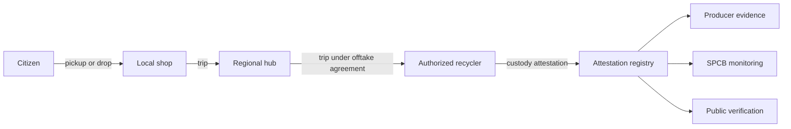

# EcoSure — End-to-End Workflows

**Last updated:** 2026-09-27 (v2)

---

## 1. Pickup state machine

```text
requested → accepted → scheduled → collected → in_lot → closed
Side states: cancelled | failed_visit | disputed
```

| State | Meaning | Actor |
|-------|---------|-------|
| `requested` | Submitted with category and count | Citizen / society / business |
| `accepted` | A shop accepted | Shop (or operator assignment) |
| `scheduled` | Window confirmed | Shop + requester |
| `collected` | Collected, weighed, wipe confirmed if needed | Shop |
| `in_lot` | Added to a lot | Shop |
| `closed` | Lot reached a recycler and was attested | System |
| `cancelled` | Cancelled before collection | Requester / shop / operator |
| `failed_visit` | Collector could not complete (gate closed, nobody home) | Shop, with reason |
| `disputed` | Exception raised | Any party |

Rules:

- Up to 3 reschedules per request by either side. Requesters can reschedule by WhatsApp keyword.
- `failed_visit` records a reason and does not count against the requester unless it happens twice for the same reason.
- `collected` requires a shop weigh record and, for data-bearing items, a wipe confirmation.
- The citizen incentive is paid on `collected`, not later.
- Every transition writes a custody event and an audit log entry.

---

## 2. Custody chain



---

## 3. Citizen pickup

1. Citizen sends a WhatsApp message or opens the web link. Login is by phone OTP (WhatsApp OTP first, SMS fallback).
2. Citizen picks mode: doorstep, drop at shop, or society drive.
3. Citizen enters categories and counts only. Device details are optional.
4. For doorstep: society, wing, flat, landmark, and gate instructions.
5. The request goes to approved or provisional shops in range. If none are in range, the citizen is told the corridor is not live there yet and can join a waitlist.
6. Shop accepts and schedules. Citizen gets WhatsApp confirmation with collector name.
7. For phones, laptops, and tablets, the citizen receives a wipe checklist in their language and confirms before handover. The collector can confirm on the citizen's behalf if the citizen asks for help ("collector assisted").
8. Shop weighs, photographs the sealed bag, and marks `collected`. This works offline.
9. UPI incentive is paid to the citizen. WhatsApp receipt includes weight, category, and the shop's name.
10. When the lot is attested, the citizen receives a final "sent for recycling" message with the attestation number.

---

## 4. Shop → hub trip

1. Shop groups collected pickups into a lot.
2. Hub plans a trip that can pick up lots from several shops on one route. The trip records vehicle, driver, and freight payer.
3. Each shop records a sender weigh record with a photo when loading.
4. Hub records a receiver weigh record at the gate. This works offline.
5. Tolerance check uses the corridor setting (default 5%, 8% during monsoon months):
   - Within tolerance: hub weight is used and the transfer is received.
   - Outside tolerance: a weight dispute opens. The undisputed weight (the lower of the two readings) is still settled on schedule.
6. Weight disputes must be raised within 72 hours of hub receipt and are resolved by the programme operator within 5 working days using both photos and scale records.

---

## 5. Hub → recycler trip

1. A hub can only send to a recycler it has an active offtake agreement with.
2. Lots must leave the hub within the agreement's maximum dwell time. A compliance flag opens when dwell is exceeded.
3. The recycler records receiver weight and grade, and may accept fully, accept partially, or reject with a reason.
4. Rejected material follows the agreement's return-freight terms. A settlement line records the cost.

---

## 6. Processing and attestation

1. Recycler processes the lot.
2. Recycler issues a custody attestation. Checks: valid CPCB authorization, processed weight not above accepted weight, period total not above authorized capacity.
3. The attestation carries the standard disclaimer: "This is a custody attestation recorded on EcoSure. It is not an EPR certificate. EPR certificates are generated only on the CPCB EPR portal."
4. The recycler may add the CPCB portal reference once the corresponding EPR certificate exists.
5. Anyone can verify the attestation by number on the public verification page, which shows issuer, date, weight, status, and whether it has been superseded. It shows no personal data.

---

## 7. Settlements and advances

- Settlements run weekly.
- Hub → shop: paid within 7 days of hub receipt for accepted weight.
- Recycler → hub: paid within the agreement's payment days.
- Shops may request an advance up to 40% of their average weekly received value over the last 4 weeks. Advances are recovered automatically from the next settlements. New shops get a smaller cap until they have 4 weeks of history.
- There is no minimum settlement amount. Small balances carry forward and are paid in the next cycle.
- Payment disputes must be raised within 7 days of the payment being marked paid.

---

## 8. Producer evidence export

1. Producer requests an export for a period, state, and language.
2. The system uses only attested lots with high- or medium-confidence attribution, or low-confidence records that have been reviewed.
3. The producer's compliance approver approves the request.
4. The file is generated and stored with its template version, attribution ruleset version, and inputs.
5. The producer files on the CPCB / SPCB portal manually. EcoSure does not submit.

---

## 9. SPCB monitoring

1. SPCB users see corridor aggregates labelled "Formal EcoSure network only".
2. Compliance flags list dwell breaches, missing attestations, weight anomalies, capacity breaches, expired registrations, and duplicate hashes.
3. SPCB users can add append-only inspection notes with their reference numbers.
4. SPCB users can download an offline inspection pack (organization list, flags, recent attestations) as PDF and CSV in English and the state language.
5. SPCB users cannot change pickups, lots, settlements, or attestations.

---

## 10. Notifications

| Event | Channel | Recipient |
|-------|---------|-----------|
| OTP | WhatsApp, then SMS fallback | User |
| Pickup accepted / scheduled / collector on the way | WhatsApp, SMS fallback | Requester |
| Collected + incentive paid | WhatsApp | Requester |
| Sent for recycling (attested) | WhatsApp | Requester |
| Trip planned / arrived | WhatsApp | Shop, hub |
| Weight dispute opened / resolved | WhatsApp | Both parties |
| Settlement paid | WhatsApp | Payee |
| Compliance flag opened | Email + in-app | SPCB, operator |

Inbound WhatsApp keywords (phase 1): `RESCHEDULE`, `CANCEL`, `GATE`, `HELP`, `STATUS`. Anything else is routed to the programme operator's support queue.
