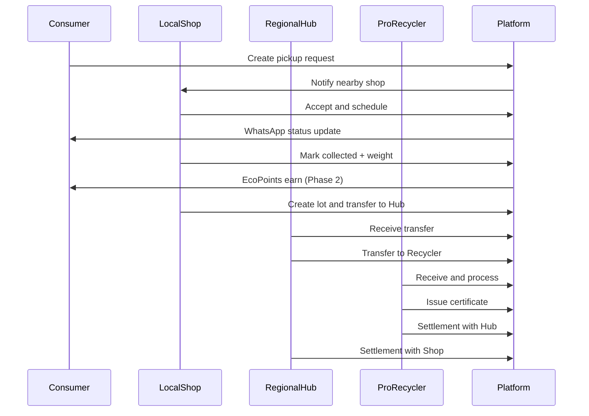

# EcoSure — End-to-End Workflows

**Last updated:** 2026-09-26

---

## 1. Pickup request state machine

```text
draft → requested → accepted → scheduled → collected
  → in_transit → received → processed → settled → closed

Side states: cancelled | disputed
```

| State | Meaning | Typical actor |
|-------|---------|---------------|
| `draft` | Incomplete request | Requester |
| `requested` | Submitted, awaiting assignment/accept | Requester |
| `accepted` | Collecting org accepted | Local Shop / Hub |
| `scheduled` | Time window confirmed | Collecting org + requester |
| `collected` | Physical collection done; weight recorded | Collecting org |
| `in_transit` | Lot moving to next org | Shop → Hub or Hub → Recycler |
| `received` | Next org confirmed receipt | Receiving org |
| `processed` | Recycler completed processing (or hub closed loop if terminal) | Pro Recycler (Phase 3+) |
| `settled` | Financial settlement posted for related lines | Hub / Recycler |
| `closed` | Terminal success | System |
| `cancelled` | Terminal cancel before collection | Requester / Admin / Org |
| `disputed` | Exception on weight, custody, or payment | Any party + Admin |

### Transition rules

- Cannot skip `collected` before EcoPoints earn (Phase 2).
- `cancelled` only if status ∈ {`draft`,`requested`,`accepted`,`scheduled`}.
- `disputed` may reopen settlement status but never delete custody events.
- Every transition writes a `CollectionEvent` + `AuditLog`.

---

## 2. Happy path — Consumer → Shop → Hub → Recycler



---

## 3. Workflow: Schedule and track pickup (Phase 1)

**Trigger:** Consumer (or business) submits pickup.  
**Steps:**

1. Requester adds items (devices and/or categories).
2. System suggests nearby approved Local Shops (geo).
3. Request enters `requested`; shops in radius can accept (or admin assigns).
4. Shop sets `scheduled_at`; requester confirms or reschedules once.
5. On collection day, shop records weight/photos metadata → `collected`.
6. Requester sees timeline of events.

**Acceptance criteria:**

- Status history visible to requester and assigned org.
- Unauthorized users cannot view the pickup (403).
- Cancel before collection clears schedule and notifies both parties.

---

## 4. Workflow: Shop → Hub transfer (Phase 1)

1. Shop opens/creates `MaterialLot` from one or more collected pickups.
2. Shop initiates `Transfer` to a linked Regional Hub.
3. Lot status `in_transit`; related pickups may show `in_transit`.
4. Hub receives, verifies weight variance within tolerance (default ±5%).
5. If variance exceeds tolerance → `disputed` + hold settlement.

---

## 5. Workflow: Hub → Recycler + certificate (Phase 3)

1. Hub transfers lot to Professional Recycler.
2. Recycler receives and processes (category recovery metadata optional).
3. Recycler issues `Certificate` with unique number + document hash.
4. Certificate linked to lot; visible to parties and attributed manufacturer.

---

## 6. Workflow: Settlements (Phase 3)

1. System aggregates eligible lots for period (default monthly).
2. Settlement draft created: Recycler→Hub and Hub→Shop lines.
3. Org finance user reviews; posts settlement.
4. Mark `paid` when payout confirmed (manual in Phase 3; rails in Phase 5).
5. Dispute window per [14-open-questions.md](./14-open-questions.md) OQ-05.

---

## 7. Workflow: EcoPoints (Phase 2)

1. On verified `collected` event, enqueue earn job with idempotency key `earn:{pickup_id}`.
2. Ledger entry created; account balance updated.
3. Redeem: user selects catalog item → ledger `redeem` if balance sufficient.
4. Clawback: admin `adjust`/`clawback` with reason; audit required.
5. Expiry job marks unused points past expiry policy.

---

## 8. Workflow: Manufacturer compliance export (Phase 4)

1. Manufacturer selects period and report type.
2. System aggregates attributed lots/certificates/weights.
3. Generates `ComplianceReport` file (CSV/PDF).
4. Download + retention per policy; generation audited.

---

## 9. Workflow: Government monitoring (Phase 4)

1. Agency user opens aggregate dashboards filtered by state/region.
2. Views totals: kg collected, orgs registered, certificates issued.
3. Views compliance flags (e.g., lots without certificate beyond SLA).
4. Submits feedback; no direct edit of operational records.

---

## 10. Notification triggers (Phase 2 WhatsApp)

| Event | Recipients |
|-------|------------|
| Pickup accepted / scheduled / collected | Requester |
| Transfer received | Sending + receiving org contacts |
| EcoPoints earned / redeemed | Consumer |
| Settlement posted | Parties |
| Certificate issued | Lot parties + attributed manufacturer |

All respect `whatsapp_opt_in` and template approval rules.
