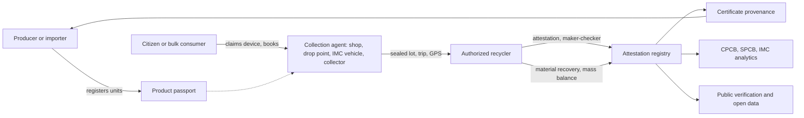

# EcoSure — End-to-End Workflows

**Last updated:** 2026-09-27 (v3)

---

## 1. Full chain



In the pilot there is no separate hub. Agents deliver to the recycler's gate. A recycler-owned hub can be added in phase 2.

---

## 2. Pickup state machine

```text
requested → accepted → scheduled → handed_over → collected → in_lot → received → closed
Side states: cancelled | failed_visit | refused_item | disputed
```

| State | Meaning | Actor |
|-------|---------|-------|
| `requested` | Submitted by WhatsApp, web, IVR, missed call, or assisted booking | Citizen / bulk consumer / assistant |
| `accepted` | An agent accepted | Agent (or operator assignment) |
| `scheduled` | Window confirmed | Agent + requester |
| `handed_over` | Collector entered the requester's handover code | Collector |
| `collected` | Weighed, sealed bag photo, wipe and battery checks done | Collector |
| `in_lot` | Added to a sealed lot | Agent |
| `received` | Lot accepted at the recycler | Recycler |
| `closed` | Lot attested | System |
| `refused_item` | An item was refused (for example, swollen battery) | Collector, with reason |

Rules:
- Up to 3 reschedules per request. Requesters can reschedule by WhatsApp keyword or IVR.
- `handed_over` needs the handover code. If the requester cannot receive it (no phone at hand), the operator can confirm by call-back, which is logged and capped.
- `collected` needs a weigh record, a wipe confirmation for data-bearing items, and a battery check for items expected to contain batteries.
- Every transition writes a custody event and an audit log entry. Passport-linked items also write lifecycle events.

---

## 3. Citizen handover

1. Citizen books by WhatsApp, web, missed call (call-back from the operator), IVR, or at a shop or ward office with help.
2. Citizen enters categories and counts. Optionally scans or types device IDs to claim them.
3. For doorstep pickups: society, wing, flat, landmark, gate instructions.
4. If no agent serves the area, the citizen is told EcoSure is not live there yet and is shown the nearest drop point or next ward drive.
5. The agent accepts and schedules. The citizen receives the collector's name, photo, a masked contact number, and a handover code.
6. At the door, the collector checks batteries (refuses swollen or damaged ones with a referral message), helps with the data-wipe checklist if asked, scans device IDs where possible, weighs, seals, and photographs the bag.
7. The collector pays the material price from the recycler's rate card on the spot (UPI or cash) as the recycler's agent. The receipt names the recycler.
8. The collector enters the handover code. The pickup becomes `collected`, and the scheme incentive becomes eligible.
9. The incentive is paid in the next daily PFMS or treasury batch (1–4 working days) to UPI, bank, voucher, or nominee.
10. When the lot is attested, the citizen receives a "recycled" message with the attestation number.

---

## 4. Agent to recycler

1. The agent groups collected pickups into a lot and seals it with a numbered tag.
2. The agent or recycler plans a trip. Vehicle GPS (government vehicle location tracking or AIS-140 devices) records the route where available; otherwise the driver posts location notes.
3. The agent records the sender weight on a connected scale where available, or manually with a photo.
4. The recycler records the receiver weight at the gate and checks the seal. A broken seal opens a custody dispute.
5. Tolerance: default 5%, 8% in monsoon months.
   - Within tolerance: receiver weight is used.
   - Outside: a weight dispute opens; the lower reading is settled on schedule.
6. Units are scanned on arrival (100% for phones and laptops in lots under 200 units, at least a 10% sample otherwise).
7. The recycler accepts, partially accepts, or rejects with a reason.
8. A lot must reach the recycler before its storage deadline (agreement maximum, never more than 180 days). A flag opens at 75% of the deadline.

---

## 5. Processing, attestation, and recovery

1. The recycler processes the lot (only recyclers dismantle; agents hand over intact items).
2. A recycler maker drafts the attestation; a different checker approves. Checks: valid CPCB registration, processed weight ≤ accepted weight, period total ≤ state-verified capacity, battery weight reported separately.
3. The attestation is digitally signed and carries the disclaimer: "This is a custody attestation recorded on EcoSure. It is not an EPR certificate. EPR certificates are generated only on the CPCB EPR portal."
4. The recycler records material recovery for the lot or period: fractions, hazardous residue, and where it was sent.
5. Monthly mass balance: opening stock + attested input = output + residue + closing stock, within 5%. Otherwise a flag opens.
6. Anyone can verify an attestation by number.

---

## 6. Payments (two rails)

**Rail A — material value (recycler money)**
- Recyclers publish rate cards per category, reviewed weekly.
- Recyclers fund a bank escrow account. Agents pay the citizen the material price and are reimbursed from escrow for accepted weight within 7 days of receipt.
- Advances to agents, up to 40% of average weekly accepted value, come from recycler escrow only. They are recovered automatically.

**Rail B — scheme incentive (public money) and producer top-ups**
- Paid only after a valid handover code and weigh record.
- Public money is paid through the state treasury system and PFMS in daily batches. The operator never holds it.
- Producer take-back programmes fund top-ups from their own escrow.
- Caps: 4 paid pickups per payee account per month, 2 units per device identifier per year (a device can only earn once), and per-address limits. Held payouts go to operator review.

**Chargebacks**
- If a pickup proves fake (for example, a duplicate device or a fake handover), the incentive is reversed where possible and the agent's next settlement is charged back. Maker-checker required.

---

## 7. Informal collectors

1. A kabadiwala or waste picker registers as a micro-tier `informal_collector` with any-of ID (NAMASTE and e-Shram IDs accepted).
2. They sign an agent agreement with a recycler, for intact items only.
3. They sell to EcoSure agents or recycler gates at the published rate and record the drop as a pickup with themselves as requester. Legacy passports are created for devices with IDs.
4. Their data is never shared with enforcement agencies except through the lawful data request process.
5. Their volume counts toward the "informal to formal" KPI.

---

## 8. Producer evidence

1. The producer registers models, units, and placed-on-market batches (see [16-product-passport.md](./16-product-passport.md)).
2. The producer or recycler enters CPCB portal certificate references. EcoSure links each to physical inflow and marks it fully backed, partially backed, or unbacked.
3. The producer requests an evidence pack: audit defence (certificate provenance), BRSR take-back data, or take-back programme results.
4. A different producer user approves before download. Each pack stores its inputs and template version.
5. The producer files on the CPCB portal. EcoSure never submits.

---

## 9. Regulator oversight

1. CPCB, SPCB, and IMC dashboards refresh at most every 15 minutes. Flags appear immediately.
2. Flags cover: storage deadline breached, attestation missing, weight anomaly, broken seal, capacity exceeded, registration expired, duplicate hash, duplicate device, mass balance variance, unbacked certificate, and payout anomaly.
3. SPCB officers link flags to Central Inspection System records instead of keeping separate inspection notes.
4. Weekly email and WhatsApp digest to the MPPCB regional officer.
5. Quarterly export in the format of the CPCB state e-waste action plan report.
6. KPI feed to the CM Dashboard through MPSEDC.
7. Regulators cannot change operational records.

---

## 10. Notifications

| Event | Channel | Recipient |
|-------|---------|-----------|
| OTP | SMS, then WhatsApp | User |
| Accepted / scheduled / collector on the way (with handover code) | WhatsApp, SMS fallback, IVR for IVR bookers | Requester |
| Collected + material price paid | WhatsApp / SMS | Requester |
| Incentive paid | SMS (payment messages always by SMS) | Requester |
| Recycled (attested) | WhatsApp | Requester |
| Trip planned / arrived; seal problem | WhatsApp | Agent, recycler |
| Dispute opened / resolved | WhatsApp | Both parties |
| Settlement paid | SMS + WhatsApp | Agent |
| Flag opened | Email + in-app; weekly digest | SPCB, operator |

Inbound WhatsApp keywords: `RESCHEDULE`, `CANCEL`, `GATE`, `HELP`, `STATUS`, `SAFETY`. Anything else goes to the operator support queue.
