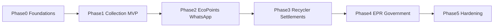

# EcoSure — Implementation Roadmap

**Stack:** Local PostgreSQL + Node.js API + web client  
**Auth:** Custom server-side auth + RBAC (not Supabase)  
**Schema:** Single idempotent `schema.sql`  
**Last updated:** 2026-09-26

This roadmap is the build plan after PRD documentation. Documentation phase does not include application code.

---

## Phase overview

| Phase | Name | Primary roles | Outcome |
|-------|------|---------------|---------|
| 0 | Foundations | Platform Admin | Runnable skeleton, auth, schema |
| 1 | Collection MVP | Consumer, Local Shop, Regional Hub | End-to-end pickup + shop→hub custody |
| 2 | Incentives & messaging | Consumer | EcoPoints + WhatsApp notifications |
| 3 | Downstream recycling | Professional Recycler | Process, certify, settle |
| 4 | EPR & regulators | Manufacturer, Government | Reports + monitoring |
| 5 | Hardening | All | KYC depth, disputes, payouts, i18n, a11y |

---

## Phase 0 — Foundations

**Deliverables**
- Monorepo or app+api scaffold
- Local PostgreSQL + idempotent `schema.sql` (users, orgs, members, locations, audit_log)
- Node API: health, auth (register/login/logout), RBAC middleware
- Platform Admin invite + org approval APIs
- Env-based config; no secrets in client
- Backup/runbook notes for local Postgres

**Exit criteria**
- Approved org can log in with correct role; rejected/pending cannot access ops routes

---

## Phase 1 — Collection MVP

**Deliverables**
- Consumer: devices, stats, education consume, nearby shops, pickup create/track/cancel
- Local Shop: profile, pickup board, collect+weigh, lots, transfer to hub
- Regional Hub: receive transfers, hub pickups, regional stats, safe platform aggregates
- Education CMS-lite for Platform Admin
- Geo nearby search
- All screens: loading/empty/success/error/unauthorized/forbidden

**Exit criteria**
- Real DB-backed flow: consumer pickup → shop collect → hub receive, with custody events

**Explicitly deferred:** EcoPoints, WhatsApp, recycler certificates, CPCB exports

---

## Phase 2 — Incentives & messaging

**Deliverables**
- EcoPoints account + append-only ledger (earn/redeem/adjust/expire/clawback)
- Redemption catalog (internal)
- WhatsApp outbound templates + opt-in
- Notification preference UI

**Exit criteria**
- Idempotent earn on verified collection; opted-out users never messaged

---

## Phase 3 — Downstream recycling

**Deliverables**
- Professional Recycler dashboard
- Hub → recycler transfers
- Lot processing + certificate issuance (immutable)
- Settlements Recycler↔Hub and Hub↔Shop
- Document storage abstraction

**Exit criteria**
- Certificate hash stored; settlement posted visible to both parties

---

## Phase 4 — EPR & regulators

**Deliverables**
- Manufacturer footprint analytics + partner discovery
- Compliance report generation (EPR summary, CPCB/SPCB-oriented exports)
- Recycler EPR support packs
- Government aggregate dashboards + compliance flags + feedback
- Report retention metadata

**Exit criteria**
- Manufacturer can download period export; government sees jurisdiction aggregates without consumer PII

---

## Phase 5 — Hardening

**Deliverables**
- Deeper KYC, dispute workflows, payout rails (optional)
- Org sub-roles (`org_admin`, `org_operator`, `org_finance`)
- Performance indexes, async report jobs at scale
- Accessibility polish, Hindi i18n hooks
- Data subject export/delete process
- Optional WebSocket status updates

**Exit criteria**
- Dispute SLA met in staging; security review checklist passed

---

## Cross-cutting implementation rules

1. Update `schema.sql` on every DB change; keep idempotent.
2. No mock operational data in production features.
3. Validate all writes; least-privilege reads.
4. Prefer smallest coherent vertical slices per phase.
5. Commit meaningful milestones with messages like `feat(phase1): consumer pickup lifecycle`.

---

## Suggested engineering order inside Phase 1

1. Schema for devices, pickups, events, lots, transfers  
2. Authz helpers for pickup visibility  
3. Consumer pickup APIs + UI  
4. Shop board + collect  
5. Hub receive  
6. Nearby search  
7. Education read + admin publish  
8. Stats aggregations  

---

## Dependencies and risks

| Risk | Mitigation |
|------|------------|
| Unclear scrap pricing | Config rate cards; see open questions |
| WhatsApp template approval delay | Ship in-app + email first |
| CPCB template drift | Versioned export mappers + expert review |
| Local Postgres single point of failure | Backups; migrate to managed PG when needed |
