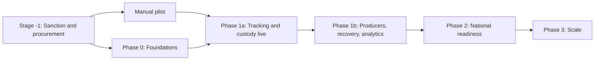

# EcoSure — Roadmap

**Last updated:** 2026-09-27 (v3)  
**Stack:** PostgreSQL + Node.js, government-hosted  
**Rule:** No stage starts until the previous gate passes.

---

## Overview

| Stage | Duration | Goal |
|-------|----------|------|
| Stage −1 | 8–16 weeks | Government order, budget sanction, procurement, MoUs, baseline |
| Manual pilot | 12 weeks (runs alongside Phase 0) | Prove agents, handover code, recycler escrow, and IMC flow with WhatsApp, spreadsheets, and bank payouts |
| Phase 0 | 8–10 weeks | Foundations: auth, organizations, agent agreements, audit, compliance baseline |
| Phase 1a | 12–14 weeks | Citizen → agent → recycler with passports (claims and legacy), handover codes, connected scales, attestations, payments, flags |
| Phase 1b | 10–12 weeks | Producer registry and evidence, material recovery, mass balance, state analytics, digests |
| Phase 2 | 10–12 weeks | CPCB national view, open standard and open data, hubs, refurbishers, bin sensors |
| Phase 3 | Ongoing | More cities and states; automated CPCB links if offered |

Realistic time from sanction to the end of phase 2: about 52–66 weeks.

---

## Stage −1 — Sanction and procurement

- Joint government order (Environment + Urban Development) naming sponsors, MPSEDC as technology agency, and a steering committee
- MPPCB direction recognising collection agents of registered recyclers
- Budget sanction and a PFMS / treasury scheme code for incentives
- Procurement of the field operator and, separately, the software vendor (MP procurement rules or GeM)
- MoUs with at least 1 authorized recycler (escrow, agent agreements) and IMC (vehicle and ward flow)
- Letters of intent from at least 3 producers for take-back programmes
- 12-month baseline of existing formal tonnes by channel
- Launch date checked against the election Model Code of Conduct and aimed at Swachhata Hi Seva (September–October)

**Exit:** order issued, contracts signed, baseline agreed.

---

## Manual pilot — Indore

Detailed plan: [`../research/pilot-design.md`](../research/pilot-design.md) (update for v3 agent model).

**What runs:** WhatsApp and a missed-call number for booking, SMS handover codes, spreadsheets as the custody log, numbered seals, recycler escrow reimbursements, treasury-batch incentives (or a sponsor-approved interim route), paper weigh slips with photos.

**Gates**

| Week | Must be true to continue |
|------|--------------------------|
| 4 | ≥ 8 agents with signed agreements; IMC flow logging; first sealed lots received by the recycler |
| 8 | ≥ 95% of paid pickups have a valid handover code; median agent reimbursement ≤ 7 days; pickup completion ≥ 70%; disputes ≤ 15%; ≥ 40% of phones collected with an identifier scanned |
| 12 | ≥ 8 tonnes a month; additional tonnes above baseline trending up; ≥ 3 producer letters of intent; MPPCB confirms flags and digests are useful |

If a gate fails, fix and repeat once. If it fails again, stop and report to the steering committee.

---

## Phase 0 — Foundations

- Repository, CI, government hosting, gov.in domain
- `schema.sql` (idempotent): users, organizations, members, statutory registrations, agent agreements, identity checks, corridors, audit log, consent records, reference data
- Phone OTP auth, sessions, org roles, authorization middleware, row-level security
- Operator console: onboarding tiers, any-of ID check, agent agreements, registration verification, launch checklist
- SMS (DLT), WhatsApp (via Business Solution Provider), missed-call service
- Compliance baseline: DPDP notices and consent, CERT-In logging and time sync, incident runbook, accessibility

**Exit:** operator can onboard a micro-tier collector, a drop point, and a verified recycler with an agent agreement; access rules tested.

---

## Phase 1a — Tracking and custody live

- Citizen: booking on all channels, device claims, wipe help, handover code, drives, bulk consumer receipts, payout methods
- Agents: queue, offline collect with battery check, device scanning and legacy passports, connected scales, seals, storage deadlines, drop point mode
- Recycler: agent network, rate cards and escrow, seal and unit checks, maker-checker attestations, reimbursements, capacity view
- Payments: escrow reimbursements, daily treasury batches, caps, chargebacks
- Government: flags, registration check, city view, public verification, RTI log
- Hindi and English everywhere; IVR booking

**Exit:** the pilot corridor runs on the software with the same or better gate metrics than the manual pilot; security audit and STQC certification passed.

---

## Phase 1b — Producers, recovery, analytics

- Producer registry (models, units, placed-on-market batches), end-of-life view, certificate provenance, evidence packs, take-back programmes, delegates
- Material recovery, mass balance, CPCB-ready inflow exports
- State analytics with problem statement KPIs, weekly digests, action-plan export, CM Dashboard feed, Central Inspection System links
- Vehicle GPS integration

**Exit:** ≥ 10 producers using the registry or packs; MPPCB uses flags in inspections; ≥ 25 tonnes a month.

---

## Phase 2 — National readiness

- CPCB national view; open passport and event specification; public API; data.gov.in open data
- Recycler-owned hubs; refurbisher events; retailer take-back counters; bin sensors
- Recognition badges

**Exit:** a second state or city can run an instance from the published standard; ≥ 50 tonnes a month in Indore.

---

## Phase 3 — Scale

- New cities and states, each adding its language and baseline
- Automated CPCB portal links if CPCB exposes an API

---

## Budget and volume gates (illustrative)

About ₹6.2 crore over 24 months, covering platform build and run, operator, incentives, IoT devices, audits, and outreach (see [`../research/v2-deep/30-budget.md`](../research/v2-deep/30-budget.md)). Funding continues only if volume reaches 8, 25, and 50 tonnes a month at the pilot, phase 1b, and phase 2 exits respectively. Cost per kg is reported monthly.

---

## Cross-cutting rules

1. Update `schema.sql` on every database change; keep it idempotent.
2. No mock operational data in production features.
3. Every screen handles loading, empty, success, error, 401, 403, and offline.
4. Commit meaningful milestones with descriptive messages.

---

## Removed or moved since v2

| Item | Change | Reason |
|------|--------|--------|
| Pithampur in pilot | Removed | Protest history and incident risk |
| Standalone hub in pilot | Moved to phase 2, recycler-owned | Breaks even only near 52 t/month |
| Target-gap view and portal worksheets | Removed | Wrong unit; the CPCB portal alone computes targets and certificates |
| Operator-held float | Removed | Not allowed for public money |
| Aadhaar-verified shop owners | Replaced by any-of ID | Aadhaar cannot be mandatory |
| Separate SPCB inspection notes | Replaced by Central Inspection System links | Avoid duplicate systems |
