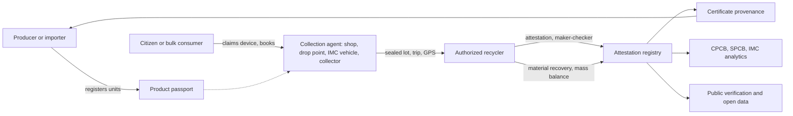
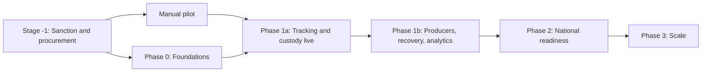

# EcoSure v3 — Complete Product Requirements Document

**Product:** EcoSure — *Making Everything Count*  
**Type:** Government initiative. State-led pilot in Indore, Madhya Pradesh, built to national standards so it can federate with the Central Pollution Control Board (CPCB)  
**Problem statement answered:** IEEE YESIST12 IEngage Track — *Sustainable E-Waste Tracking & Recovery Platform for India*  
**Version:** v3 (consolidated), 2026-09-27  
**Planned stack:** PostgreSQL (one idempotent `schema.sql`) + Node.js API, government-hosted, mobile-first installable web app, WhatsApp, SMS, and voice channels  
**Status:** Design complete; pending sponsor confirmation, fact verification, and a manual pilot

> This single document explains every idea, fix, and change behind EcoSure v3, with the reasoning and research behind each decision. The shorter topic files in this folder (`00`–`18`) remain the working reference for each area; where they differ, this document and those files were written together and should agree. If they do not, treat it as a bug and fix both.

---

## Table of contents

1. [Executive summary](#1-executive-summary)
2. [The problem](#2-the-problem)
3. [How we got here: v1 → v2 → v3](#3-how-we-got-here-v1--v2--v3)
4. [Alignment with the problem statement](#4-alignment-with-the-problem-statement)
5. [Programme structure and governance](#5-programme-structure-and-governance)
6. [Vision, positioning, and design principles](#6-vision-positioning-and-design-principles)
7. [Stakeholders and personas](#7-stakeholders-and-personas)
8. [Roles and access control](#8-roles-and-access-control)
9. [Product passport and lifecycle tracking](#9-product-passport-and-lifecycle-tracking)
10. [Citizen and bulk consumer experience](#10-citizen-and-bulk-consumer-experience)
11. [Collection agents: shops, informal collectors, drop points](#11-collection-agents-shops-informal-collectors-drop-points)
12. [Authorized recycler](#12-authorized-recycler)
13. [Producer (manufacturer and importer)](#13-producer-manufacturer-and-importer)
14. [Government: SPCB, CPCB, and the city](#14-government-spcb-cpcb-and-the-city)
15. [Regional hub (phase 2)](#15-regional-hub-phase-2)
16. [End-to-end workflows and state machines](#16-end-to-end-workflows-and-state-machines)
17. [Money: the two-rail payment design](#17-money-the-two-rail-payment-design)
18. [Fraud, integrity, and trust](#18-fraud-integrity-and-trust)
19. [Domain model](#19-domain-model)
20. [Integrations, IoT, and cloud](#20-integrations-iot-and-cloud)
21. [Security, privacy, and the regulatory compliance baseline](#21-security-privacy-and-the-regulatory-compliance-baseline)
22. [Inclusion, language, and safety](#22-inclusion-language-and-safety)
23. [Operating calendar: seasons, festivals, elections](#23-operating-calendar-seasons-festivals-elections)
24. [Success metrics and how they are measured](#24-success-metrics-and-how-they-are-measured)
25. [Roadmap and stage gates](#25-roadmap-and-stage-gates)
26. [Budget and volume gates](#26-budget-and-volume-gates)
27. [Risks, pre-mortem, and tripwires](#27-risks-pre-mortem-and-tripwires)
28. [Complete change log](#28-complete-change-log)
29. [Sponsor decisions and open questions](#29-sponsor-decisions-and-open-questions)
30. [Honest limits](#30-honest-limits)
31. [Glossary](#31-glossary)
32. [Appendix: research and norms index](#32-appendix-research-and-norms-index)

---

## 1. Executive summary

### 1.1 What EcoSure is

EcoSure is a government-run digital platform that tracks electronic products from the day they are manufactured or imported until the day their materials are recovered by an authorized recycler. It does five things:

1. **Gives products a digital identity.** Producers register the units they sell. Citizens can claim their own devices. Old devices with no record get one when they are collected. This is the *product passport*.
2. **Records every formal hand-off.** Citizen to collector, collector to recycler, recycler to processing — each step has weight, photo, seal, and, where available, connected-scale and GPS evidence. This is the *custody chain*.
3. **Brings the informal sector in.** Kabadiwalas, small scrap shops, and waste pickers join as documented agents of licensed recyclers, keeping their same-day cash business while becoming legal and visible.
4. **Pays people to do the right thing.** Citizens receive the recycler's material price on the spot plus a government incentive after they confirm the handover.
5. **Gives regulators evidence they can trust.** CPCB, the state pollution control board (MPPCB), and the city see near real-time analytics and risk-ranked flags, and producers can prove that their EPR certificates are backed by real material.

### 1.2 Why it is designed this way

The original idea (v1) was a six-dashboard SaaS with EcoPoints rewards. Field research with simulated Tier-2/3 users, feasibility analysis, a senior product review, a government-initiative reframe, and a 36-agent review of Indian law and adoption showed that v1 would fail on cash, trust, law, and money flow. Each version fixed what the previous one got wrong:

| Version | Core idea | Why it changed |
|---------|-----------|----------------|
| v1 | Private SaaS marketplace with EcoPoints for six stakeholder types | Points lose to the kabadiwala's cash; monthly payments starve shops; English-first; government was an afterthought |
| v2 | Government custody-and-evidence network with UPI incentives, weekly settlement, and a manual pilot | Scored 4.6/10 against real Indian norms: collectors had no legal standing, batteries were ignored, public money flow broke finance rules, it duplicated Indore's existing collection, and it did not track products from manufacture |
| v3 | Product passport + custody layer over existing collection + informal agents + two-rail payments + regulator analytics, aligned to the YESIST12 problem statement | Current design |

### 1.3 Key numbers

| Item | Value |
|------|-------|
| Pilot | Indore city only, 12 weeks manual, then software |
| Time from sanction to national-readiness (end of phase 2) | About 52–66 weeks |
| Budget (illustrative) | About ₹6.2 crore over 24 months |
| Volume gates | 8, 25, and 50 tonnes a month at the pilot, phase 1b, and phase 2 exits |
| Headline KPI | Formal collection at least 30% above the agreed pre-pilot baseline |
| Score of v2 against Indian norms | 4.6 / 10 (36-agent average) |
| Estimated score of v3 | About 6.5–7 / 10 (estimate; not yet independently re-reviewed) |
| Pre-mortem survival | About 30% for v2; about 60% with the v3 changes (estimate) |

### 1.4 What EcoSure will never do

- Issue, trade, or broker EPR certificates. The CPCB EPR portal is the only statutory system.
- File on the CPCB portal on anyone's behalf.
- Pretend to count all e-waste. Every number says "formal EcoSure network only".
- Handle hazardous waste, biomedical waste, loose batteries, or municipal solid waste.
- Let collectors dismantle devices.

---

## 2. The problem

### 2.1 The problem statement (IEEE YESIST12)

India is the third-largest producer of e-waste globally, generating over 1.7 million tonnes a year, growing fast with smartphone penetration, cheap electronics, and programmes such as Digital India and Make in India. Product lifecycles are getting shorter.

Despite the E-Waste (Management) Rules 2016 and 2022, the problem statement identifies five persistent challenges:

- over 80% of e-waste is handled by the informal sector
- limited traceability from production to end of life
- poor collection efficiency in Tier-2 and Tier-3 cities
- low consumer awareness and incentives
- weak enforcement of Extended Producer Responsibility (EPR)

These cause environmental contamination, loss of valuable metals, worker health risks, and revenue leakage for formal recyclers.

It asks for a secure, scalable, interoperable **Circular E-Waste Tracking & Recovery Platform** tailored to India that:

1. enables digital tracking of electronic products from manufacturing or import to disposal
2. integrates formal and informal sector participants
3. ensures compliance with India's EPR regulations
4. incentivises responsible disposal by consumers
5. provides real-time analytics for regulators (CPCB / SPCB)

### 2.2 What stops formal recycling today (from our research)

The research added a ground-level explanation of *why* the challenges persist:

| Root cause | What it looks like on the ground |
|------------|----------------------------------|
| **Cash beats paperwork** | The kabadiwala pays the same day at the door. Formal channels pay late, pay nothing, or ask for forms |
| **No shared record** | Material changes hands 3–5 times with no trail. Nobody can prove where a tonne came from or went |
| **Fake paper is cheaper than real recycling** | EPR certificates have been generated by "ghost" recyclers with little or no physical material. Producers buy through brokers without knowing |
| **Informal workers fear formalisation** | Registration looks like exposure to police, tax, or eviction. Dismantling earns them extra money today |
| **Tier-2/3 logistics** | Few collection points, long distances to recyclers, patchy networks, power cuts, monsoon damage |
| **Trust at the door** | Fear of data left on phones; society and PG gate rules; English-only apps; unknown collectors |
| **Regulators are stretched** | MPPCB reportedly has about 64% of posts vacant. Officers already use several systems (CPCB portal, XGN, Central Inspection System) and cannot adopt another dashboard |
| **Duplicate efforts** | Indore Municipal Corporation (IMC) reportedly already collects about 2–2.5 tonnes a day of e-waste through garbage vehicles and vendors (unverified). A new network that ignores this wastes public money |

### 2.3 Scope of the problem

| In scope | Out of scope |
|----------|--------------|
| E-waste as defined in Schedule I of the E-Waste (Management) Rules 2022 | Hazardous waste (except recording where recyclers send hazardous residue) |
| Batteries embedded in devices, travelling with the device | Loose or damaged batteries (Battery Waste Management Rules 2022 channel) |
| | Biomedical waste, municipal solid waste, other waste categories |

---

## 3. How we got here: v1 → v2 → v3

This section explains the research journey, because every v3 decision traces back to something we learned.

### 3.1 v1 — the original idea

The original PRD described "Ecosure" as an all-in-one platform with six dashboards:

- **Consumer:** add devices, track usage, waste statistics, education, nearby shops, pickup scheduling, EcoPoints rewards, WhatsApp notifications.
- **Local recycle shop:** profile, nearby pickup requests, scheduling, statistics, training, payouts.
- **Regional hub:** profile, requests from shops, scheduling, statistics, settlements with shops, platform statistics.
- **Professional recycler:** profile, requests from hubs, settlements, certificates and EPR documentation.
- **Manufacturer:** e-waste from their products, nearby recyclers, EPR compliance and CPCB/SPCB reports.
- **Government:** statistics, education, payout and profitability view, feedback, compliance monitoring.

**Decisions made at this stage:** local PostgreSQL (no Supabase) with a Node.js backend; documentation and roadmap before any code; Consumer, Shop, and Hub as the first phase.

### 3.2 Research round 1 — Tier-2/3 field simulation

We deployed persona agents living in Tier-2/3 Indian cities (Nashik, Gwalior, Bhagalpur, Coimbatore, Kolhapur–Sangli, Indore) using the product. They surfaced real problems:

- EcoPoints redeemable "later" lose to the kabadiwala's cash "now".
- Shops cannot survive monthly settlement; they divert material to informal buyers for immediate cash.
- Small shops have no GSTIN and cannot wait weeks for approval.
- The launch map would be empty, and citizens would leave.
- English-first screens and Hindi "in phase 5" block adoption from day one.
- Phones carry personal data; nobody hands them over without a wipe step.
- Society gates, PG owners, and landmark-based addresses break coordinate-only pickups.
- OTP failures on some networks; WhatsApp is the real channel.
- One truck collects from several shops; a fixed ±5% weight tolerance fails in monsoon.
- Nothing works without signal; power cuts are common.

Full report: [`../research/tier2-tier3-field-issues.md`](../research/tier2-tier3-field-issues.md).

### 3.3 Research round 2 — feasibility without UI

Multiple agents per role tested whether the idea works regardless of screens. Findings: the recycler must be in the first phase because nothing is verifiable without it; "certificates" issued by the platform would be confused with legal EPR certificates; the government "revenue and profitability" view had no purpose; building six dashboards before testing anything was the biggest risk. Report: [`../research/idea-feasibility-no-ui.md`](../research/idea-feasibility-no-ui.md).

### 3.4 Research round 3 — senior product and research review

A multi-scenario review (24-month scenario matrix, competitive and substitute analysis, illustrative unit economics, regulatory and political scenarios, pilot design, go-to-market memo) concluded that a points-first consumer marketplace would fail in Tier-2/3 India, and that the viable product is a **custody and evidence network** anchored on authorized recyclers. Synthesis: [`../research/00-senior-pm-research-synthesis.md`](../research/00-senior-pm-research-synthesis.md).

### 3.5 The government reframe

You clarified that EcoSure is a government initiative. That changed the design: the SPCB becomes a core sponsor, data is department-owned, a contracted operator runs the field, and success is measured in public outcomes rather than revenue. Reframe: [`../research/gov-initiative-reframe.md`](../research/gov-initiative-reframe.md).

### 3.6 v2 — the strengthened PRD

v2 fixed 26 weaknesses of v1: UPI incentive at collection instead of EcoPoints; weekly shop settlement within 7 days with advances; micro KYC with provisional operation; corridor launch checklist; Hindi and WhatsApp in phase 1; mandatory data-wipe step; society and gate details; up to 3 reschedules; offline operation; trips with multiple shops; seasonal tolerance; hub-paid freight; offtake agreements; recycler in phase 1; "custody attestations" with disclaimer and public verification; fraud caps; producer tools in phase 2 with attribution review and export approval; honest "formal network only" labels; and a 12-week manual pilot before software. On paper, v2 scored about 6.9 / 10.

### 3.7 Research round 4 — the 36-agent norms and adoption review

We then ran 36 research agents in two waves:

- **Wave 1 (18 agents, law and norms):** E-Waste Rules 2022, CPCB EPR portal, legal status of intermediaries, DPDP Act, GIGW and accessibility, hosting and CERT-In, government payments, SMS and WhatsApp rules, Aadhaar, procurement, RTI, Madhya Pradesh context, batteries, informal sector, Indian and international precedents, funding, fake certificates.
- **Wave 2 (18 agents, performance and adoption):** citizens in Indore and Tier-3 towns, society drives, micro shops, drop points, hub economics, recyclers, producers, SPCB officers, operator staffing, fraud red team, budget, political stakeholders, technical feasibility, inclusion, seasonal stress, pre-mortem, partnerships.

**Result: v2 averaged 4.6 / 10** (law 4.9, adoption 4.4), and the pre-mortem gave it about a 30% chance of surviving to September 2028. The earlier 6.9 was too high because it measured only product problems, not law, public finance, or Indore's reality.

The five structural problems found:

1. **Collectors had no legal standing.** Only producers, manufacturers, refurbishers, and recyclers register under the 2022 Rules. A shop or hub is lawful only as a documented agent of a registered entity.
2. **Batteries are a separate legal regime** (Battery Waste Management Rules 2022) with their own storage limits, manifests, and fire risk.
3. **The money design broke government finance rules.** Public money moves through the treasury and PFMS in batches, not instant UPI; a private operator cannot hold public float.
4. **It ignored Indore's existing collection**, building a small, expensive parallel network beside a much larger city flow.
5. **The producer view used the wrong unit.** EPR targets and certificates are computed on the CPCB portal in its own units; a brand-weight "target gap" misleads.

Synthesis: [`../research/v2-deep/00-synthesis.md`](../research/v2-deep/00-synthesis.md).

### 3.8 The problem statement check

Comparing v2 with the YESIST12 problem statement showed roughly a 55–60% match. v2 met informal integration and consumer incentives well, but it:

- tracked sacks from collection onward, not products from manufacture or import
- listed IoT as out of scope, though IoT and Cloud are problem statement keywords
- deferred EPR compliance and had no CPCB view
- measured operational metrics instead of the problem statement's KPIs

### 3.9 v3 — this document

v3 keeps what v2 got right (cash at collection, weekly pay, micro KYC, Hindi, WhatsApp, offline, attestations that are never certificates, honest coverage, pilot first) and adds the product passport, the agent-of-recycler legal model, the custody layer over existing flows, two-rail payments, stronger fraud controls, material recovery and mass balance, certificate provenance, regulator analytics for CPCB, SPCB, and the city, connected devices, a full compliance baseline, inclusion channels, a realistic procurement timeline, a budget, and the problem statement's KPIs.

---

## 4. Alignment with the problem statement

### 4.1 Objectives

| # | Objective | How v3 meets it | Sections |
|---|-----------|-----------------|----------|
| 1 | Track products from manufacture or import to disposal | Product passport: producer unit registry, placed-on-market batches, citizen claims, legacy passports at collection, lifecycle events through to material recovery | 9, 13 |
| 2 | Integrate formal and informal participants | Informal collectors and kabadi shops as micro-tier agents of registered recyclers; NAMASTE and e-Shram IDs accepted; IMC and producer drop points | 11, 16.6 |
| 3 | Ensure EPR compliance | Agent-of-recycler legal model; 180-day storage cap; registration and capacity checks; certificate provenance; audit defence packs; CPCB-ready recycler records; mass balance | 12, 13, 21 |
| 4 | Incentivise responsible consumer disposal | Material price on the spot plus scheme incentive after the handover code; producer top-ups; drives with pooled incentives | 10, 17 |
| 5 | Real-time analytics for CPCB and SPCB | State analytics refreshed every 15 minutes; flags within 1 minute; CPCB national view; digests; action-plan export; CM Dashboard feed | 14 |

### 4.2 Keywords

| Keyword | Where it appears in v3 |
|---------|------------------------|
| E-Waste | Schedule I categories; E-Waste Rules 2022 legal model |
| Sustainability | Material recovery efficiency; refurbishment events; data for Net Zero reporting |
| Re-Cycle | Recycler attestations, material recovery, mass balance |
| IoT | Connected weighing scales, vehicle GPS (AIS-140), drop-bin fill sensors |
| Cloud | MeitY-empanelled government cloud; India-resident; built to scale nationally |

### 4.3 Constraints and assumptions

| Problem statement item | v3 response |
|------------------------|-------------|
| Comply with E-Waste Rules 2016 and 2022 | Agent model, intact items only, 180-day cap, Schedule I categories |
| Align with CPCB / SPCB | CPCB portal remains statutory truth; CPCB-ready exports; Central Inspection System links |
| DPDP Act 2023 | Notices, consent, minimisation, hashed identifiers, rights, breach process |
| Limited collection centres in Tier-2/3 | Drop points, drives, informal agents, IMC vehicles |
| No standard product IDs across manufacturers | IMEI, serial, or EcoSure QR; fallback to category and weight |
| Legacy devices without records | Legacy passports created at collection |
| Informal dominance of last mile | Informal collectors become agents |
| Limited technical skill among recyclers | Hindi screens, CSV exports matching portal fields, operator support |
| Hazardous handling requirements | Intact only for agents; battery triage; hazardous residue tracked at recyclers |
| Assumption: smartphone penetration above 70% | Smartphone-first, with voice and assisted channels for the rest |
| Assumption: cloud is accessible and scalable | Government cloud, stateless API, federation |
| Assumption: unique device IDs exist for major categories | Used where present; not required for the chain to work |

### 4.4 Expected outcomes and KPIs

Every problem statement KPI is a headline v3 metric (section 24 explains how each is measured):

| Problem statement KPI | v3 target (Indore, 12 months) |
|-----------------------|-------------------------------|
| Formal collection rate up ≥ 30% | ≥ 30% above baseline |
| % increase in traceable e-waste | ≥ 90% of recycler inflow with a complete chain |
| Reduction in informal processing share | Measurable reduction in a before-and-after survey |
| Consumer participation rate | ≥ 5% of households in covered wards |
| Material recovery efficiency | Reported for 100% of attested lots |
| Regulatory reporting accuracy | ≥ 95% match with CPCB portal filings |

The full traceability matrix lives in [17-problem-statement-alignment.md](./17-problem-statement-alignment.md).

---

## 5. Programme structure and governance

### 5.1 Sponsors

**Decision:** a joint government order from the **Environment Department** (with MPPCB) and the **Urban Development and Housing Department** (with Indore Municipal Corporation). **MPSEDC**, the state e-governance agency, is the nodal technology agency.

**Why:** v2 named the SPCB and the IT department only. The political-stakeholder review found that e-waste collection in cities is a municipal function (urban local bodies run collection under solid waste rules) while enforcement is the pollution board's job. A single-department sponsor would face turf conflict with the city, and the city already runs an e-waste flow. A joint order gives both a stake. MPSEDC brings hosting, the CM Dashboard link, and a faster procurement route through nomination.

A **steering committee** (Environment, Urban Development, MPPCB, IMC, MPSEDC, Finance representative) reviews stage gates and tripwires monthly.

### 5.2 Legal model for collectors

**Decision:** every shop, drop point, informal collector, and (later) hub is a **documented collection agent** of a named CPCB-registered recycler or producer, under a written agent agreement, backed by an **MPPCB direction** recognising such agents. Agents handle **intact items only** (no dismantling) and must deliver within the agreement's storage limit, never more than **180 days**.

**Why:** the 2022 Rules removed the separate registration for collection centres and dismantlers that existed in 2016. Only producers, manufacturers, refurbishers, and recyclers register. The CPCB's own guidance, as reported by our legal-research agents, is that collection must be done by or on behalf of registered entities. A platform approval gives no legal cover. The agent model uses what the law already allows: registered recyclers and producers can collect through their own channels. It also makes the recycler accountable for its agents, which is the strongest fraud control available.

### 5.3 Relationship to existing collection

**Decision:** EcoSure is the **tracking and custody layer over existing flows** — IMC vehicles and ward points, producer take-back points, PROs, and recyclers' own networks. New shops are added only where coverage is thin.

**Why:** the partnership review compared three options — (A) parallel network, (B) pure data layer, (C) hybrid custody layer — and found only C scores well (about 7.5 / 10 versus 4 for v2's parallel network). The budget review showed a parallel network would spend 2–8 times the value of each tonne it formalises at pilot volumes, while connecting IMC's existing flow gets to the 50–100 tonnes a month where unit costs make sense.

### 5.4 Operations

**Decision:** the department owns the platform and data. A **field operator** is contracted under a service-level agreement for onboarding, support, disputes, and field help. The **software vendor** is contracted separately.

**Why:** combining operator and vendor creates lock-in and hides performance problems. Separate contracts let the department replace either one. The operator never holds money (section 17).

### 5.5 Hosting

**Decision:** MeitY-empanelled government cloud or the state data centre; all data and backups in India.

**Why:** required for government applications handling personal data, and needed for CERT-In log retention and the DPDP Act. It also meets the problem statement's "Cloud" keyword with a scalable, government-approved option.

### 5.6 Pilot geography

**Decision:** **Indore city only.** Pithampur is dropped from the pilot.

**Why:** Indore has the population, the Swachh Survekshan track record, an active municipal corporation, and authorized recyclers. Pithampur has a history of protests about hazardous waste handling and industrial incidents; associating a new e-waste programme with it in the pilot adds political risk without adding volume.

### 5.7 National path

EcoSure is built so other states and CPCB can use it: an open data model and event API (phase 2), a CPCB national read view, and one instance per state that federates aggregates. The Indore pilot proves the model; the design is national.

---

## 6. Vision, positioning, and design principles

### 6.1 Vision

EcoSure is India's circular e-waste tracking and recovery platform, starting in Indore. It gives every electronic product a digital record from manufacture or import to recycling, counts every formal hand-off, includes informal collectors as recognised partners, rewards citizens for responsible disposal, and gives CPCB and SPCB near real-time evidence they can trust.

### 6.2 What EcoSure is, and is not

| EcoSure is | EcoSure is not |
|------------|----------------|
| A product passport registry | The CPCB EPR portal |
| A custody chain with two-party evidence | An issuer or trader of EPR certificates |
| The way informal collectors join the formal chain | A points or rewards app |
| An EPR evidence layer linking certificates to physical material | A replacement for the kabadiwala's cash price |
| Regulator analytics for CPCB, SPCB, and the city | A parallel collection network competing with the city or PROs |
| | A complete count of all e-waste |

### 6.3 Design principles, with reasons

| # | Principle | Why |
|---|-----------|-----|
| 1 | **Track the product, not just the sack.** Devices with IDs keep them through the chain; others are counted by category and weight | Problem statement objective 1; device IDs catch duplicates and ghost inflow |
| 2 | **Layer, do not duplicate.** Connect existing flows before adding shops | Budget and partnership reviews |
| 3 | **Recycler is the root of trust.** Every lot ends at a registered recycler; every collector is its agent | Legal model; accountability |
| 4 | **Evidence from two parties.** Weight, custody, and payout each need two independent confirmations | Fraud red team: single-party claims are the main fraud surface |
| 5 | **Honest artifacts.** Attestations are never called certificates; all are publicly verifiable | Avoid confusion with EPR certificates and legal risk |
| 6 | **Honest coverage.** Every number says "formal network only" and shows additional tonnes above baseline | Additionality scandal was a top failure story |
| 7 | **Hindi first, voice and WhatsApp friendly** | Tier-2/3 reality; GIGW; Madhya Pradesh is Hindi-speaking |
| 8 | **Works offline** | Patchy signal and power cuts |
| 9 | **Lawful by design** | DPDP, CERT-In, GIGW, E-Waste Rules are requirements |
| 10 | **Real data only** | No mock operational data in any production feature |

---

## 7. Stakeholders and personas

### 7.1 Stakeholder map

| Stakeholder | Role code | What they do in EcoSure | Phase | Why they join |
|-------------|-----------|-------------------------|-------|---------------|
| Citizen / household | `citizen` | Hands over e-waste; claims devices | 1a | Fair price, incentive, data safety, proof of recycling |
| Bulk consumer (society, office, school) | `bulk_consumer` | Rule 8 disposal; hosts drives | 1a | Legal duty to hand over to registered channels; clean documentation |
| Local collection shop | `local_shop` | Recycler's agent; first custody point | 1a | Steady volume, payment in 7 days, legal cover |
| Informal collector / waste picker | `informal_collector` | Recognised agent | 1a | Same cash business, recognition, protection |
| Drop point (IMC, retailer, PRO) | `drop_point` | Logs existing collection | 1a | Count and get credit for what they already do |
| Indore Municipal Corporation | `ulb_officer` | Co-sponsor; vehicles, ward drives | 1a | Swachh Survekshan credit; less dumping |
| Authorized recycler | `pro_recycler` | Root of trust; attestations, recovery | 1a | More legal feedstock; defence against fake-paper accusations |
| Producer / importer | `producer`, `producer_delegate` | Product registry; EPR evidence | 1b | Audit defence; BRSR data; take-back programmes |
| MPPCB | `spcb_officer` | Monitors, inspects | 1a / 1b | Enforcement evidence with few staff |
| CPCB | `cpcb_officer` | National view | 2 | National picture; standard for other states |
| Regional hub | `regional_hub` | Recycler-owned consolidation | 2 | Full trucks on long routes |
| Refurbisher | `refurbisher` | Reuse events | 2 | Circularity credit |
| Programme operator | `programme_operator` | Runs the field | 0 | Contract |
| Public information officer | `public_information_officer` | Decides RTI requests | 1a | Statutory role |

### 7.2 Personas

Each persona captures a real blocker from our research and what EcoSure must do about it.

**Priya — teacher, Indore (citizen).** Wants two old phones, a laptop, and a broken mixer gone safely on a Saturday. Blocked by fear of data on phones, society gate rules, and "points later". Needs: Hindi WhatsApp flow, category-and-count booking, wipe help, handover code, fair price on the spot plus incentive, proof her phone was recycled.

**Kamla — homemaker, Mhow (no smartphone).** Wants to get rid of an old TV and radio without going to a shop. Blocked by a basic phone, no UPI, and no English. Needs: missed-call booking, Hindi IVR, bank or voucher payout, a collector with an ID card.

**Kallu — kabadiwala, Indore (informal collector).** Wants to keep his daily cash business and avoid trouble with officials. Blocked by fear that registration exposes him, no GST, and dismantling for extra value. Needs: micro tier with NAMASTE or e-Shram ID, an agent agreement with a recycler, same-day price, a promise his data is not used against him.

**Ramesh — shop owner, Indore (local shop).** Wants steady volume and money within days. Blocked by GSTIN demands, slow payment, English screens, storage limits he does not understand. Needs: micro tier, weekly reimbursement from recycler escrow, advances, Hindi, clear storage deadlines.

**Sunita — society secretary, Vijay Nagar (bulk consumer).** Wants one drive for 200 flats and a receipt her committee accepts. Needs: drive entity, gate pass, receipt naming the recycler, per-resident incentives.

**Rakesh — IMC ward sanitary inspector (city).** Wants to count e-waste already collected and earn Swachh Survekshan credit. Needs: vehicle logging, drive calendar, ward reports.

**Arjun — authorized recycler operations, Indore.** Wants more legal feedstock and no fake-paperwork accusations. Needs: agent network management, seal checks, unit scans, maker-checker attestations, mass balance, CPCB-ready records.

**Neha — EPR compliance executive, Mumbai (producer).** Wants evidence that survives a CPCB audit and data for BRSR. Blocked by certificates bought through brokers with no physical proof. Needs: product registry, certificate provenance, audit defence pack, take-back results, approval before download.

**Suresh — MPPCB regional officer, Indore.** Wants honest numbers and inspection targets with too few staff. Needs: risk-ranked flags, weekly digest, links to Central Inspection System records, Hindi exports.

**Programme operator.** Wants a corridor that runs without firefighting. Needs: launch checklist, support queue and SLAs, dispute queue, payout reconciliation, baseline tracking.

### 7.3 Shared needs

Money on time; proof that material and devices went where they should; Hindi, voice, and WhatsApp; works with poor signal; clear separation between platform approval and statutory registration; legal safety for everyone who handles e-waste.

---

## 8. Roles and access control

### 8.1 Principle

Least privilege. Personal data and money stay with the owning party. Regulators see evidence and aggregates, not people. Authorization is enforced on the server for every request and again in the database (row-level security) as a second line of defence.

### 8.2 Roles

`citizen`, `bulk_consumer`, `local_shop`, `informal_collector`, `drop_point`, `regional_hub`, `pro_recycler`, `refurbisher`, `producer`, `producer_delegate`, `ulb_officer`, `spcb_officer`, `cpcb_officer`, `programme_operator`, `public_information_officer`, and `public` (unauthenticated).

Organization members also hold an org role: `owner`, `operator`, `finance`, `approver`, or `viewer`. `approver` exists because attestations, evidence packs, chargebacks, and incentive reversals need a second person (maker-checker).

### 8.3 Capability matrix

Legend: **F** full for own scope · **R** read · **W** write · **A** approve · **Agg** aggregate only · **—** none

| Capability | Citizen / bulk | Agent (shop, collector, drop point) | Recycler | Producer / delegate | City | SPCB / CPCB | Operator | Public |
|------------|----------------|-------------------------------------|----------|---------------------|------|-------------|----------|--------|
| Own profile | F | F | F | F | F | F | F | — |
| Approve organizations and agent agreements | — | — | A (own agents) | — | — | R | A | — |
| Register models and units | — | — | — | F | — | Agg | R | — |
| Claim a device | W | — | — | — | — | — | — | — |
| Legacy registration at collection | — | W | W | — | W | — | — | — |
| Create pickup or drive | W | W (assisted) | — | W (bulk) | W (ward drive) | — | W | — |
| Accept, collect, weigh | — | F | — | — | F (city flow) | — | F | — |
| Lots, seals, trips | — | W | R (inbound) | — | W | R | F | — |
| Accept or reject transfers | — | — | W | — | — | — | A (disputes) | — |
| Issue attestations (maker-checker) | — | — | W | — | — | R | R | — |
| Material recovery, mass balance | — | — | W | R (attributed) | — | R | R | — |
| Verify attestation by number | R | R | R | R | R | R | R | R |
| Rate cards | — | R | W | — | — | R | R | — |
| Settlements and advances | — | R (own) | F | — | — | — | R | — |
| Citizen incentives | R (own) | — | — | Fund | — | Agg | F | — |
| Certificate provenance | — | — | W | W | — | R | R | — |
| Evidence packs (maker-checker) | — | — | R (share) | F | — | — | R | — |
| Compliance flags | — | own | own | own | own ward | R | F | — |
| Inspection links | — | — | — | — | — | W (SPCB) | R | — |
| Analytics | — | own | own | own | ward | Agg | F | Open data |
| Submit RTI or data request | W | W | W | W | W | W | R | W |
| Decide RTI | — | — | — | — | — | — | — | — (PIO only) |
| Audit logs | own | own org | own org | own org | own | Agg | F | — |

### 8.4 What each role must never see

| Role | Must not access |
|------|-----------------|
| Citizen / bulk consumer | Other people's pickups or claims; organization finances |
| Agents | Full address before accepting; other agents' jobs or payouts; raw device identifiers |
| Recycler | Other recyclers' rates, agents, agreements; citizen identities |
| Producer / delegate | Citizen identities; other producers' data; raw identifiers of other producers' units |
| City | Citizen identities outside the city's own flow; money data |
| SPCB / CPCB | Citizen personal data, bank details, individual settlements — unless a lawful request is decided |
| Operator | Personal data outside a logged support or audit purpose; RTI decisions |
| Public | Anything except attestation number, issuer, date, weight, category, status; open aggregates with small cells suppressed |

### 8.5 Onboarding tiers

| Organization | Tier | Can operate | Requirement |
|--------------|------|-------------|-------------|
| Shop / informal collector | Micro, provisional | Up to 500 kg a month | Any-of ID (DigiLocker, Aadhaar offline QR, in-person ID, NAMASTE ID, e-Shram card), photo, payout account, signed agent agreement. No GSTIN |
| Shop | Standard, approved | No cap within agreement | Documents reviewed; GSTIN if registered |
| Drop point | Approved | Yes | Host organization letter, agent agreement |
| Hub | Approved (phase 2) | Recycler-owned or contracted | Storage and fire check, agent agreement |
| Recycler | Approved | After CPCB registration and state-verified capacity checked | Registration number, validity, capacity from MPPCB consent |
| Producer | Approved | Yes | CPCB EPR registration |
| Producer delegate | Approved | For named producers | Signed mandate per producer |
| City, SPCB, CPCB | Approved | Yes | Nominated by department |

**Why "any-of ID":** Aadhaar cannot be made mandatory for a service like this without a government notification under the Aadhaar Act and its 2025 good-governance rules, and many informal workers have other IDs. EcoSure never stores Aadhaar numbers or documents — only the check result and the method.

### 8.6 Enforcement rules

1. Every request authenticates the user and resolves role, organization, org role, and agent agreement.
2. Pickup visibility: requester, assigned agent, and the principal recycler once the pickup is in a lot.
3. Passport visibility: registering producer (own units), claimant (own claims), handling agents (last 4 characters only).
4. Unauthenticated → 401. Authenticated without permission → 403 with a stable error code and no data.
5. All operator, SPCB, and CPCB access to personal data is logged with a reason.
6. Maker-checker actions require two different users.

---

## 9. Product passport and lifecycle tracking

This is the core answer to problem statement objective 1 and the biggest addition in v3.

### 9.1 The idea

Every electronic unit with a unique identifier gets a **product passport**: a record of the unit and the events in its life. Producers and importers register units when they reach the market. Citizens claim devices they own. Devices with no passport — which today is almost every device in use — get one when they are collected. The passport then joins the custody chain, so a phone can be followed from factory or port to the recycler that processed it and the materials recovered from it.

The passport records **what happened to a unit, not who owns it.** Ownership and personal data are kept separate and minimal.

### 9.2 Why this design

- **The problem statement requires it** ("digital tracking of electronic products from manufacturing/import to disposal").
- **It solves fraud that weight alone cannot.** A phone that has already been processed cannot earn an incentive twice; a recycler claiming 10,000 phones must be able to scan them.
- **It gives producers something they cannot get elsewhere:** evidence that *their own* units reached authorized recyclers.
- **It works with the problem statement's constraint** that there is no standard product ID across manufacturers, by accepting several identifier types and falling back to category and weight.
- **It handles legacy devices**, which the problem statement lists as a constraint, by creating passports at collection.

### 9.3 Identifiers

| Identifier | Used for | Storage |
|------------|----------|---------|
| IMEI | Phones and cellular devices | Keyed hash (HMAC-SHA-256 with a server-held key). Raw IMEI never stored |
| Manufacturer serial | Laptops, appliances, other equipment | Keyed hash, scoped to producer and model |
| EcoSure QR | Any unit; printed by producers or issued at collection | Random public ID with no personal data; GS1 Digital Link style URL |
| Category + weight | Units with no readable identifier | No unit record; counted in the lot |

Only the last 4 characters of an IMEI or serial are ever displayed. Matching works by hashing what is scanned and comparing hashes. **Why hashes:** IMEIs are sensitive (they relate to telecom subscribers and stolen-phone systems), and storing them raw would create a high-value breach target.

### 9.4 Lifecycle states

```text
registered → placed_on_market → claimed → handed_over → collected → in_lot
→ received_at_recycler → processed → materials_recovered
Side states: refurbished (back to claimed), exported_for_reuse, lost, disputed
```

| State | Recorded by | Evidence |
|-------|-------------|----------|
| `registered` | Producer / importer | Bulk upload or API with model, identifiers, manufacture or import date |
| `placed_on_market` | Producer | Sale or dispatch batch by month and state |
| `claimed` | Citizen or bulk consumer | QR scan or IMEI / serial entry (optional) |
| `handed_over` | Citizen + collector | Handover code entered by the collector |
| `collected` | Agent | Weigh record and sealed-bag photo |
| `in_lot` | Agent | Linked to a sealed lot |
| `received_at_recycler` | Recycler | Receiver weight and unit scan |
| `processed` | Recycler | Custody attestation |
| `materials_recovered` | Recycler | Material recovery record |
| `refurbished` | Registered refurbisher | Refurbishment record; unit returns to use |

Every change is an append-only event with actor, time, ward or site, and evidence.

### 9.5 Features

**PP1 Producer model and unit registry (phase 1b).** Producers register models (brand, name, Schedule I category, typical weight, battery type, data-bearing flag), upload units by CSV (up to 1 million rows per file) or API, and record placed-on-market batches by month and state. Invalid rows are reported, never silently dropped. Identifiers are hashed on arrival and upload files deleted after processing. Producers see only their own units.

**PP2 Citizen device claim (phase 1a).** Scan an EcoSure QR, dial `*#06#` and enter the IMEI, or type a serial. If the unit exists, the claim links to it; if not, a legacy passport is created. A unit can have one active claim; a second claim opens a review and holds that unit's incentive. Claims are optional.

**PP3 Legacy registration at collection (phase 1a).** At the door, the collector scans the IMEI or serial barcode of each data-bearing device (offline). Category and count are required; brand and model are optional. Devices without identifiers are still accepted and counted.

**PP4 Chain linking (phase 1a).** Each passport links to its pickup item, lot, transfer, attestation, and recovery record. Recyclers scan units on arrival: 100% of phones and laptops in lots under 200 units, at least a 10% random sample otherwise. Missing units open a flag. A unit already `processed` that appears in a new pickup opens a duplicate flag and earns no incentive.

**PP5 Device history for citizens (phase 1a).** Citizens see collected, received, and processed status with the attestation number for devices they claimed or handed over.

**PP6 Producer lifecycle view (phase 1b).** Counts of the producer's units by state, category, and state of India; units collected through EcoSure by month; share with linked passports. No citizen identities; ward-level geography only.

**PP7 Retail, service, and refurbishment events (phase 2).** Refurbishers record resale; retailer take-back counters log exchanges; units exported for reuse are recorded with the permit reference.

**PP8 Open standard (phase 2).** The passport model and event API are published as an open JSON schema so other states, CPCB, and producer systems can exchange records. The public API returns only non-personal data.

### 9.6 Privacy rules for passports

1. Identifiers stored only as keyed hashes; the key sits in a hardware-backed key store and is rotated with re-hashing.
2. Passports hold no names, phone numbers, or addresses. Claims live in a separate private table.
3. Police or telecom requests follow the lawful data request process.
4. Deleting a citizen account removes the claim link but keeps the anonymous passport and custody events.
5. Stolen-phone blocking belongs to the Department of Telecommunications' CEIR system; EcoSure only links to it.

### 9.7 Honest limit

Device-level tracking reaches its full value only when producers register units. Until then, most passports are created at collection. The target for the pilot is that at least 60% of phones and laptops collected have a linked passport.

---

## 10. Citizen and bulk consumer experience

### 10.1 Summary

Citizens and bulk consumers hand over e-waste by doorstep pickup, drop point, or drive. They get the recycler's material price on the spot, a scheme incentive on top after confirming the handover, and a message when their material is recycled.

### 10.2 Features and reasons

**C1 Sign-in and channels (1a).** Phone OTP by SMS, with WhatsApp as an alternative (10-minute validity, resend after 30 seconds, 5 attempts per hour). Hindi is the default. Booking works by WhatsApp, web, **missed call** (operator calls back within 4 working hours), **IVR** (reusing CM Helpline 181 infrastructure if the department agrees), and **assisted booking** at shops and ward offices. A consent notice appears before first use.
*Why:* Tier-3 and elderly users often lack smartphones or data; the inclusion review scored v2 3/10 for leaving them out. SMS is the OTP default because payment and OTP messages must be reliable and are regulated through TRAI DLT.

**C2 Pickup request (1a).** Category + count with plain-language examples; brand, model, photo optional. Modes: doorstep, drop point, drive. Doorstep needs society, wing/flat, landmark, pincode. If no agent serves the area, show the nearest drop point and next ward drive with a waitlist — never an empty map.
*Why:* nobody knows model numbers of old devices; empty maps kill first-time trust.

**C3 Device claim (1a).** Optional QR or IMEI scan (section 9.5).

**C4 Data-wipe help (1a).** For data-bearing items: back up, sign out, factory reset, remove SIM and memory card — in the user's language. The citizen confirms or asks the collector for help ("collector assisted"). A data-bearing item cannot be collected without a confirmation. Photos show sealed bags only, never device screens.
*Why:* data fear was the single biggest reason citizens held on to phones.

**C5 Scheduling (1a).** Slots including weekend mornings; up to 3 reschedules by app, WhatsApp `RESCHEDULE`, or IVR; `GATE` keyword alerts the collector; first failed visit carries no penalty.

**C6 Safe handover (1a).** Before the visit the citizen gets the collector's name, photo, ID number, and a masked phone number, plus a **4-digit handover code** to give only after weighing and payment. A `SAFETY` keyword or button reaches the operator immediately. Swollen or damaged batteries are refused with a referral message.
*Why:* doorstep safety (especially for women at home) and fraud control. The code proves the citizen actually handed something over.

**C7 Price and incentive (1a).** The collector pays the **recycler's published material price on the spot** (UPI or cash), with a receipt naming the recycler and agent. The **scheme incentive** is paid in the next daily treasury batch (1–4 working days) after a valid handover code. Payout options: UPI, bank, voucher at a partner outlet, or a nominee's account. Caps: 4 paid pickups per payee account per month; a device identifier earns only once; per-address limits. No new or increased incentives during an election Model Code of Conduct.
*Why:* v2 paid only an incentive, which is smaller than what a kabadiwala pays, so it still lost on cash. Paying the market price at the door matches the kabadiwala, and the incentive becomes the reason to choose the formal channel. Public money cannot move as instant UPI from a private operator, so it goes in treasury batches.

**C8 Status and receipt (1a).** Messages at accepted, scheduled (with code), on the way, collected (weight and price), incentive paid, and recycled (attestation number and verification link).

**C9 Drives (1a).** A drive has a host (society, office, school, IMC ward), date, time, expected volume, and agent. It is confirmed when expected volume passes 150 kg (or the operator overrides). Residents register by WhatsApp link or at the desk. Batch weighing at the drive; each resident still gets a receipt, code, and incentive. Residents can pool incentives for the society fund. Hosts get a participation certificate (clearly not an EPR certificate).
*Why:* the society-drive review found drives are the densest, cheapest channel in Indian cities; the threshold avoids sending a truck for 12 kg.

**C10 Bulk consumer disposal (1a).** Offices and institutions register as organizations. Receipts name the registered recycler, satisfying Rule 8. Government offices get an assisted mode recording GeM or MSTC disposal references where e-auction rules apply.

**C11 Education (1a).** Hindi guides, voice clips, and posters: what counts as e-waste, how to wipe devices, battery safety, why formal recycling matters.

**C12 Recognition (2).** Optional civic badges; no points or catalog.

### 10.3 Screen states

Loading, empty, success, error, 401 (sign in), 403 (message), offline (last known status, queued actions), payout held.

---

## 11. Collection agents: shops, informal collectors, drop points

### 11.1 Summary

Agents are the first custody point. Each acts for a named registered recycler or producer, handles intact items only, pays citizens the recycler's price, seals lots, and delivers to the recycler before the storage deadline.

### 11.2 Features and reasons

**S1 Onboarding (1a).** Micro tier needs any one ID (DigiLocker, Aadhaar offline QR, in-person check, NAMASTE ID, e-Shram card), a photo, a payout account, and a signed agent agreement (e-sign or paper upload). Provisional operation up to 500 kg a month while documents are reviewed; decision within 3 working days in plain Hindi. Standard tier for shops with full documents. A plain-language notice promises data is used only to run the programme and is shared with enforcement only through the lawful request process.
*Why:* the micro-shop review found GST and waiting times were the main blockers; the informal-sector review found fear of exposure was the main reason kabadiwalas stay out.

**S2 Pickup queue (1a).** Requests in range with locality, categories, counts, and window; full address after accepting; works offline.

**S3 Collect (1a).** Battery check per item (no battery / intact embedded — accepted / swollen or damaged — refused). Wipe confirmation for data-bearing items. Barcode scan of IMEI or serial where possible. Weigh on a connected scale or enter weight with a photo of the display. Pay the material price and record it. Enter the handover code (5 attempts max). Large buttons, icons, Hindi labels.
*Why:* battery fires are a real risk (the seasonal and battery reviews cited godown fires in 2026); only recyclers are allowed to dismantle.

**S4 Lots and delivery (1a).** Seal each lot with a numbered tamper-evident tag. The storage deadline (never over 180 days) is shown on every lot, with a warning at 75%. Record sender weight at loading; deliver to the recycler's gate or join a recycler-planned trip.

**S5 Money (1a).** Home screen leads with amount due, next payment date, and advance outstanding. Reimbursement for accepted weight within 7 days of recycler receipt, from recycler escrow. Undisputed weight is paid even if part of a lot is disputed. Advances up to 40% of average weekly accepted value (20% for new agents), from recycler escrow, recovered automatically. Chargebacks after proven fraud shown with evidence.

**S6 Rates (1a).** Recycler rate card with version and date; WhatsApp message when rates change.

**S7 Drop point mode (1a).** Walk-in logging (category, count, optional scan, optional phone number of the person dropping off for their code and incentive). Bin fill sensors (phase 2) trigger collection trips.

**S8 Disputes (1a).** Weight or seal disputes within 72 hours of receipt with photos; the operator resolves within 5 working days.

**S9 Stats (1a).** Pickups, kilograms, devices with passports, completion rate, failed-visit reasons — shown below money.

**S10 Training (1a).** Hindi videos: battery safety, data-wipe help, weighing and sealing, storage limits, conduct and safety.

### 11.3 Out of scope for agents

Dismantling; loose or damaged batteries; seeing other agents' data; setting rates; issuing attestations.

---

## 12. Authorized recycler

### 12.1 Summary

Recyclers are the root of trust. They appoint and manage agents, fund escrow, receive sealed lots, scan units, accept or reject material, issue maker-checker attestations, and report material recovery and monthly mass balance. EcoSure charges no commission on scrap value.

### 12.2 Features and reasons

**R1 Onboarding (1a).** CPCB registration number, validity, and capacity from the MPPCB consent to operate, verified against official lists. Expired registration or consent blocks attestations and agent collections.
*Why "state-verified capacity":* fake-certificate cases involved recyclers claiming output far above their real capacity.

**R2 Agent network (1a).** Invite, approve, and suspend agents with agreements; see each agent's volume, disputes, flags, and deadlines.

**R3 Rate cards and escrow (1a).** Publish prices per category (reviewed weekly). Link a bank escrow account. Low-balance alert below 2 weeks of expected reimbursements; new pickups for that recycler's agents pause at zero.
*Why:* the recycler owns the material value, so it should fund the material payment. This keeps public money out of commercial transactions.

**R4 Inbound and grading (1a).** Inbound trips with sender weights and GPS route; seal check (broken seals open a custody dispute); receiver weight; unit scans (100% under 200 phones and laptops, 10% sample otherwise); accept, partial accept, or reject with reasons and photos.

**R5 Custody attestations (1a).** Drafted by a maker, approved by a different checker, digitally signed. Checks: valid registration; processed weight ≤ accepted weight; period total ≤ state-verified capacity; battery weight reported separately and excluded. Unique public number and SHA-256 hash. Mandatory disclaimer: *"This is a custody attestation recorded on EcoSure. It is not an EPR certificate. EPR certificates are generated only on the CPCB EPR portal."* Corrections supersede; old versions stay visible.

**R6 Material recovery and mass balance (1b).** Output fractions per lot or month (metals, plastics, boards, glass, residue, hazardous residue) and where each went. Monthly mass balance: opening stock + attested input = output + residue + closing stock, within 5%.
*Why:* the problem statement asks for material recovery efficiency; mass balance is the strongest check against ghost recycling.

**R7 CPCB-ready inflow records (1b).** Monthly export in the fields recyclers file on the CPCB portal, so filings and EcoSure match (this drives the "regulatory reporting accuracy" KPI). Recyclers enter certificate references generated from EcoSure inflow.

**R8 Public verification (1a).** Anyone can check an attestation by number (issuer, date, weight, categories, status). No personal data or prices. Duplicate hashes raise a flag.

**R9 Reimbursements and advances (1a).** Pay agents within 7 days of receipt; approve advances; chargebacks with maker-checker.

**R10 Capacity view (1a).** Attested tonnes against capacity with a warning at 80%.

---

## 13. Producer (manufacturer and importer)

### 13.1 Summary

Producers register products they place on the market, see what happened to them at end of life, prove their CPCB certificates are backed by real material, and report take-back results. The CPCB portal remains the only place for targets, filings, and certificates.

### 13.2 Why the producer module changed

v2 offered a "target-gap view" and "portal worksheets". The CPCB EPR portal review found that EPR targets are set by the portal from placed-on-market data, and certificates are generated there by recyclers in units the portal computes. A brand-attributed weight total from EcoSure does not map to those units and could mislead a compliance team into thinking they were covered. The producer-value review found what producers actually lack: **proof that the certificates they bought are backed by real recycling** (fake-certificate scandals make this an audit risk), **data for their annual BRSR report**, and **credible take-back programmes**.

### 13.3 Features

**P1 Onboarding (1b).** CPCB EPR registration verified; brands and categories; org roles owner, approver, operator, viewer. **Delegates** (PROs, consultants) added per producer with a signed mandate.
*Why:* many producers outsource EPR work to PROs; without a delegate role they would share logins.

**P2 Product registry (1b).** Models, units, placed-on-market batches (section 9.5, PP1).

**P3 End-of-life view (1b).** Own units by lifecycle state, category, and state; units collected, received, processed by month with attestation numbers.

**P4 Certificate provenance (1b).** Enter certificate references from the portal exactly as shown (number, quantity, unit, issuing recycler). EcoSure links each to that recycler's attestations and inflow and marks it **fully backed, partially backed, or unbacked**. Unbacked certificates from participating recyclers raise a flag for the producer and SPCB. EcoSure never recalculates quantities.

**P5 Evidence packs (1b).** Audit defence (provenance with weigh, seal, GPS, and mass-balance evidence), BRSR take-back data, and take-back programme results. English, Hindi, or bilingual; inputs and template version stored; download needs a second producer user's approval; 7-year retention. Every file states: *"Supports EPR compliance evidence. EcoSure does not issue EPR certificates. The producer is responsible for filings on the CPCB EPR portal."*

**P6 Take-back programmes (1b).** Producers fund citizen top-ups for their brand or category from their own escrow, with budget, per-unit amount, categories, and dates. Gated on a signed letter of intent.

**P7 Recycler directory (1b).** Participating recyclers with CPCB registration shown separately from platform approval.

**P8 Bulk collection (1a).** Producer offices, service centres, and warehouses request collection as bulk consumers.

---

## 14. Government: SPCB, CPCB, and the city

### 14.1 Summary

Regulators and the city get near real-time evidence. No government user can change operational records.

### 14.2 Why this design

The SPCB-adoption review found MPPCB is badly understaffed (about 64% of posts reportedly vacant) and already works in the CPCB portal, XGN (online consent management), and its Central Inspection System. Another dashboard would go unused. So EcoSure pushes risk-ranked flags and digests and links into existing systems. The problem statement's "real-time analytics for regulators" is met by 15-minute refresh and flags within a minute.

### 14.3 Features

**G1 Onboarding (1a).** Officers nominated by departments, scoped to CPCB (national), MPPCB (state and regional office), or IMC (city and wards).

**G2 Compliance flags (1a).** Storage deadline breached, attestation missing past SLA, weight anomaly, broken seal, capacity exceeded, registration expired, duplicate hash, duplicate device, mass-balance variance, unbacked certificate, payout anomaly. Ranked by risk (severity × weight × age), with evidence. Read-only; SPCB officers can link a flag to a Central Inspection System record.

**G3 Registration check (1a).** Statutory registration and platform status side by side; SPCB can mark a registration verified or disputed.

**G4 State analytics (1b).** Refresh ≤ 15 minutes. Tonnes collected, received, attested, recovered by district, ward, category, month. All problem statement KPIs. Share of weight confirmed by a second party or connected scale. Every chart says *"Formal EcoSure network only. Excludes informal channels."*

**G5 Weekly digest (1b).** Email and WhatsApp to each MPPCB regional officer: top flags, tonnes, new agents, expiring registrations.

**G6 Reports and feeds (1b).** Quarterly export in the CPCB state e-waste action plan format; district inspection pack in Hindi and English; KPI feed to the CM Dashboard via MPSEDC.

**G7 City view (1a).** IMC logs vehicle and ward-point collections; ward drive calendar; ward tonnes for Swachh Survekshan.

**G8 CPCB national view (2).** Aggregates from every federated state; recycler inflow vs portal filings; unbacked certificate flags across states.

**G9 Public verification and open data.** Attestation check (1a); monthly aggregates on data.gov.in with small cells (under 10 households or 3 organizations) suppressed (2).

**G10 Lawful requests and RTI (1a).** Requests logged with legal basis; the **public information officer decides**, the operator only prepares data; disclosure follows the published policy, including the DPDP Act's amendment to RTI section 8(1)(j). Proactive disclosure of the operator contract, SLAs, and performance.

**G11 Feedback (1a).** Structured feedback with category and priority.

---

## 15. Regional hub (phase 2)

### 15.1 Why the hub moved out of the pilot

The hub-economics review found a standalone hub breaks even only around **52 tonnes a month**, far above pilot volumes. In Indore, agents can reach recyclers directly. So the pilot has no hub. In phase 2, a hub is added only where a corridor is far from its recycler, and it is **owned or contracted by the recycler** so it holds material as the recycler's agent.

### 15.2 Features (phase 2)

- **H1 Onboarding:** agent agreement; storage, fire (lithium-suitable extinguishers), and monsoon checks.
- **H2 Trips:** multi-agent trips with vehicle, driver, route, freight payer (never the shop by default), GPS.
- **H3 Receive:** receiver weight, seal check, tolerance 5% (8% monsoon); lots stay sealed.
- **H4 Inventory:** by lot, age, and the original storage deadline (180 days total still applies).
- **H5 Outbound:** consolidated trips to the recycler.
- **H6 Surge mode:** Diwali and Dussehra — extended hours, overflow storage, temporary labour.
- **H7 Stats:** tonnes in and out, dwell, load factor, dispute rate, cost per tonne.

---

## 16. End-to-end workflows and state machines

### 16.1 The full chain



In the pilot there is no hub; agents deliver to the recycler's gate.

### 16.2 Pickup state machine

```text
requested → accepted → scheduled → handed_over → collected → in_lot → received → closed
Side states: cancelled | failed_visit | refused_item | disputed
```

| State | Meaning | Actor | Gate to enter |
|-------|---------|-------|---------------|
| `requested` | Booked on any channel | Citizen / bulk / assistant | Valid category and area |
| `accepted` | Agent accepted | Agent or operator | Agent has an active agreement |
| `scheduled` | Window confirmed | Agent + requester | — |
| `handed_over` | Code entered | Collector | Valid, unexpired handover code (or logged operator call-back, capped) |
| `collected` | Weighed and sealed | Collector | Weigh record; wipe confirmation for data-bearing items; battery check |
| `in_lot` | In a sealed lot | Agent | Lot open and within storage deadline |
| `received` | Accepted at recycler | Recycler | Receiver weight; seal check |
| `closed` | Attested | System | Attestation issued |
| `refused_item` | Item refused | Collector | Reason recorded |

Every transition writes a custody event and an audit entry; passport-linked items also write lifecycle events.

### 16.3 Citizen handover, step by step

1. Book by WhatsApp, web, missed call, IVR, or with help at a shop or ward office.
2. Enter categories and counts; optionally claim devices.
3. Doorstep: society, wing, flat, landmark, gate instructions.
4. No agent in area → nearest drop point, next ward drive, waitlist.
5. Agent accepts and schedules; citizen gets collector name, photo, ID, masked number, and handover code.
6. At the door: battery check (refuse damaged), wipe help if asked, device scans, weighing, sealing, photo.
7. Collector pays the recycler's material price and gives a receipt naming the recycler.
8. Collector enters the handover code → `collected`; incentive becomes eligible.
9. Incentive paid in the next treasury batch (1–4 working days).
10. Lot attested → citizen receives a "recycled" message with the attestation number.

### 16.4 Agent to recycler

1. Group pickups into a lot sealed with a numbered tag.
2. Plan a trip; GPS records the route where available, otherwise location notes.
3. Sender weight at loading (connected scale or photo).
4. Recycler records receiver weight and checks the seal; a broken seal opens a custody dispute.
5. Tolerance 5% (8% in monsoon months). Within → receiver weight used. Outside → dispute opens; the lower reading is settled on time.
6. Unit scans on arrival (100% under 200 phones/laptops; 10% sample otherwise).
7. Accept, partial accept, or reject with reasons.
8. Lot must arrive before its storage deadline (never over 180 days); flag at 75%.

### 16.5 Processing, attestation, and recovery

1. Recycler processes (only recyclers dismantle).
2. Maker drafts, checker approves, attestation is signed and carries the disclaimer.
3. Recycler records material recovery and hazardous residue destinations.
4. Monthly mass balance within 5%, otherwise a flag.
5. Anyone can verify the attestation by number.

### 16.6 Informal collectors

1. Register as micro-tier `informal_collector` with any-of ID (NAMASTE and e-Shram accepted).
2. Sign an agent agreement with a recycler, intact items only.
3. Sell to agents or recycler gates at the published rate, recorded as pickups; legacy passports for devices with IDs.
4. Their data is never shared with enforcement except through the lawful request process.
5. Their volume counts toward the "informal to formal" KPI.

*Why this works:* the informal-sector review found kabadiwalas respond to price, speed, and safety, not paperwork. The agent route keeps their cash cycle, gives them a legal status they lack today, and moves the dismantling step (where health harm happens) to recyclers.

### 16.7 Producer evidence

1. Producer registers models, units, and placed-on-market batches.
2. Producer or recycler enters CPCB certificate references; EcoSure marks each fully, partially, or not backed.
3. Producer requests a pack (audit defence, BRSR, take-back).
4. A different producer user approves; inputs and template version are stored.
5. Producer files on the CPCB portal; EcoSure never submits.

### 16.8 Regulator oversight

1. Dashboards refresh ≤ 15 minutes; flags appear within 1 minute.
2. Flags are risk-ranked with evidence.
3. SPCB links flags to Central Inspection System records.
4. Weekly digest to regional officers.
5. Quarterly action-plan export; CM Dashboard feed.
6. Regulators cannot change records.

### 16.9 Notifications

| Event | Channel | Recipient |
|-------|---------|-----------|
| OTP | SMS, then WhatsApp | User |
| Accepted / scheduled (with code) / on the way | WhatsApp, SMS fallback, IVR for IVR bookers | Requester |
| Collected + price paid | WhatsApp / SMS | Requester |
| Incentive paid | SMS | Requester |
| Recycled | WhatsApp | Requester |
| Trip planned / arrived; seal problem | WhatsApp | Agent, recycler |
| Dispute opened / resolved | WhatsApp | Both parties |
| Settlement paid | SMS + WhatsApp | Agent |
| Flag opened | Email + in-app; weekly digest | SPCB, operator |

Inbound WhatsApp keywords: `RESCHEDULE`, `CANCEL`, `GATE`, `HELP`, `STATUS`, `SAFETY`. Everything else goes to the operator support queue.

---

## 17. Money: the two-rail payment design

### 17.1 Why v2's money design had to change

The payments and funding reviews found three problems with v2:

1. **Public money cannot be paid as instant UPI from a private operator.** State scheme money moves through the state treasury system (IFMIS) and PFMS, typically in daily batches that take 1–4 working days.
2. **A contracted operator cannot hold government float.** Advances to shops from scheme money would be audit objections.
3. **Paying out other people's money over UPI** at scale needs a regulated payment-aggregator arrangement; the operator is not one.

The pre-mortem rated "money and procurement stall" as the most likely fatal story (about 35% for v2).

### 17.2 The two rails

| Rail | Whose money | What it pays | Route | Speed |
|------|-------------|--------------|-------|-------|
| **A — Material value** | Recycler | Material price to citizen (paid first by the agent), agent reimbursement, advances | Recycler-funded bank escrow under a tripartite agreement (bank, recycler, department) | Agent pays citizen at the door; agent reimbursed within 7 days |
| **B — Scheme incentive** | State | Incentive on top of the price | Treasury / PFMS daily batch | 1–4 working days |
| **B′ — Producer top-up** | Producer | Take-back programme top-ups | Producer-funded escrow | Batch |

**The operator never holds any money.**

### 17.3 Worked example (illustrative numbers)

Priya hands over two phones and a mixer, 1.4 kg in total.

1. The recycler's rate card says phones ₹60 each, small appliances ₹25/kg. The collector pays Priya ₹120 + ₹20 = ₹140 by UPI at the door, as the recycler's agent.
2. Priya gives the handover code. The pickup becomes `collected`.
3. That night, the scheme incentive (say ₹50 per data-bearing device = ₹100) is added to the next day's treasury batch. Priya receives it within 1–4 working days by SMS-confirmed transfer.
4. The phones' brand has a take-back programme paying ₹30 per phone from its escrow → Priya gets ₹60 more.
5. The lot reaches the recycler 5 days later; accepted weight is confirmed. Within 7 days, escrow reimburses the collector ₹140 plus the agent's handling margin in the rate card.

Priya gets ₹300 in total, more than a kabadiwala would pay. The state pays only the ₹100 top-up. The recycler pays the material value it will recover.

### 17.4 Rules

- **Incentive trigger:** valid handover code + collector weigh record. Nothing else.
- **Caps:** 4 paid pickups per payee account per month; each device identifier earns once; per-address limits; held payouts go to operator review.
- **Advances:** up to 40% of average weekly accepted value (20% for new agents), from recycler escrow only, recovered automatically.
- **Chargebacks:** proven fraud reverses incentives where possible and charges the agent's next settlement; maker-checker required.
- **Escrow health:** alert below 2 weeks of expected reimbursements; new pickups pause at zero.
- **Reconciliation:** daily for every payout; idempotency keys on every payment.
- **No minimum payout;** small balances carry forward.
- **Disputes:** weight within 72 hours; payment within 7 days of being marked paid.

---

## 18. Fraud, integrity, and trust

### 18.1 Why fraud is central

The fraud red team and fake-certificate reviews showed that every subsidy-linked recycling programme attracts fraud: fake pickups for incentives, weight inflation, recycled devices re-entered, ghost recyclers generating certificates without material, and collusion. A government platform that "launders" paper recycling would be a scandal (pre-mortem story 4).

### 18.2 Threats and controls

| Threat | How it happens | Control in v3 |
|--------|----------------|---------------|
| Fake pickups | Agent books pickups for friends' phones to farm incentives | Handover code to the requester's phone; caps per payee account, device, address; concentration monitoring (top 5% of accounts) |
| Same device paid twice | A processed phone re-enters as a new pickup | Device identifier earns once; duplicate-device flag |
| Weight inflation | Agent adds bricks or water; manual weight entry | Dual weighing, connected scales with calibration certificates, photo of display, tolerance checks |
| Lot tampering | Swapping good material for junk in transit | Numbered tamper-evident seals, GPS routes, seal check at receipt |
| Cherry-picking | Agents sell high-value items informally and send only junk | Device-count leakage tripwire (recycler count ÷ agent count); high-value share trend |
| Ghost recycler inflow | Recycler reports tonnes it never received | Unit scans, mass balance, capacity from state consent |
| Unbacked EPR certificates | Certificates sold without real processing | Certificate provenance flags |
| Collusion in attestations | One insider issues fake attestations | Maker-checker with different users; digital signature |
| Agent fraud patterns | Repeated anomalies | Per-agent anomaly score; suspension; chargebacks |
| Identity misuse | Fake accounts | Any-of ID for agents; payout account name match |

### 18.3 Pre-mortem tripwires (monitored monthly)

| Tripwire | Amber | Red (stop and fix) |
|----------|-------|--------------------|
| Sponsor decisions confirmed in writing | < 80% by pilot week −4 | Incentive funding, operator, escrow, or MPPCB direction missing at week 0 |
| Time from collected to incentive | > 24 hours median | > 4 working days median |
| Agent reimbursement time | > 7 days median | > 10 days median, two weeks running |
| High-value share of agent lots | Falls 2 weeks running | Falls 4 weeks running |
| Additional tonnes vs baseline | < 50% of reported tonnes | Baseline not measured |
| Incentive concentration (top 5% of payee accounts) | > 15% of spend | > 25% of spend |
| Device-count leakage (recycler ÷ agent) | < 97% | < 90% |
| Loose batteries in lots | Any | Any repeated |
| Committed incentive budget ahead | < 12 months | < 6 months without a transition plan |
| Grievances from non-enrolled kabadiwalas | Any organised statement | Protest or press coverage |

---

## 19. Domain model

### 19.1 Entity groups

**Identity and organizations:** User; Organization (types: `local_shop`, `drop_point`, `informal_collector`, `regional_hub`, `pro_recycler`, `refurbisher`, `producer`, `pro`, `bulk_consumer`, `ulb`, `spcb_office`, `cpcb_office`, `programme_operator`); OrganizationMember; StatutoryRegistration; **AgentAgreement**; **IdentityCheck**; Corridor; Location; Address.

**Product passport:** **ProductModel**, **ProductUnit**, **PlacedOnMarketBatch**, **UnitClaim**, **LifecycleEvent**.

**Collection and custody:** PickupRequest, PickupItem, **CollectionDrive**, **HandoverCode**, WipeConfirmation, **BatteryCheck**, Lot (with seal tag), Trip, Transfer, WeighRecord, Dispute, CustodyAttestation, **MaterialRecovery**, **MassBalance**.

**Connected devices:** **IoTDevice**, **IoTReading**.

**Money:** RateCard (recycler-owned), **EscrowAccount**, Settlement, SettlementLine, ShopAdvance, AdvanceRecovery, CitizenIncentive, **PayoutBatch**, **Chargeback**.

**Compliance and oversight:** **CertificateProvenance**, **EvidencePack**, **PackApproval**, **TakeBackProgramme**, ComplianceFlag, **InspectionLink**, **Baseline**, **DataRequest**, **ConsentRecord**, **BreachIncident**.

**Platform:** EducationalContent, Notification, **IVRCall**, OfflineSyncBatch, AuditLog, Feedback.

(Bold = new in v3.)

### 19.2 Key relationships

```text
Organization (recycler | producer) 1──* AgentAgreement *──1 Organization (agent)
ProductModel 1──* ProductUnit 1──* LifecycleEvent
ProductUnit 0..1──* UnitClaim *──1 User
User 1──* PickupRequest 1──* PickupItem 0..1──1 ProductUnit
PickupRequest 1──1 HandoverCode
Lot 1──* Transfer *──1 Trip;  Transfer 1──* WeighRecord 0..1──1 IoTReading
Lot 1──0..1 CustodyAttestation 1──0..1 MaterialRecovery
CertificateProvenance *──* CustodyAttestation
PickupRequest 1──0..1 CitizenIncentive *──1 PayoutBatch
```

### 19.3 Important fields

- **AgentAgreement:** principal (must hold valid CPCB registration), agent, categories, `max_storage_days` (≤ 180), `intact_only` (always true), validity, MPPCB direction reference.
- **ProductUnit:** model (nullable for legacy), category, identifier type, identifier hash, last 4 characters, QR public ID, state, legacy flag.
- **HandoverCode:** code hash, expiry, used time, attempts (lock after 5).
- **BatteryCheck:** `no_battery` | `intact_embedded` | `swollen_or_damaged_refused`.
- **Lot:** agent, principal, unique seal tag, net weight, unit count, storage deadline.
- **WeighRecord:** sender or receiver, gross/tare/net, IoT reading link, scale device, photo, entry method.
- **IoTReading:** device, type, value, device time, receive time, signature validity (expired calibration → stored but not used for money).
- **CustodyAttestation:** public number, lot, issuer, registration, processed weight, battery weight (separate), unit count, maker, checker, SHA-256, signature, supersedes, disclaimer version.
- **MaterialRecovery:** fractions (metals, plastics, boards, glass, residue), hazardous residue, destinations.
- **MassBalance:** opening, input, output, residue, closing, variance (> 5% flags).
- **CertificateProvenance:** CPCB certificate reference, quantity and unit exactly as on the portal, issuing recycler, holder producer, linked attestations and input, coverage status.
- **CitizenIncentive:** amount, funding source, payout method (UPI, bank, voucher, nominee), batch, status (eligible, batched, paid, failed, held, reversed), idempotency key.
- **Baseline:** channel (city, PRO, recycler direct, other), period, tonnes, source, agreed by.

### 19.4 Integrity rules

1. Lifecycle events, custody events, weigh records, IoT readings, attestations, audit logs are append-only.
2. Money is `numeric(12,2)`; weight is `numeric(12,3)`.
3. Unique: phone, QR public ID, identifier hash per scope, seal tag, attestation number, attestation hash, idempotency keys.
4. No collection without an active agent agreement whose principal holds valid registration.
5. Lots cannot pass their storage deadline silently.
6. Attestation maker and checker must differ.
7. Processed weight ≤ accepted; period total ≤ capacity; battery weight excluded.
8. A processed unit cannot re-enter without a duplicate flag.
9. Incentives need a used handover code; caps enforced.
10. Offline records keep capture time; conflicts resolved by the receiver and logged.

### 19.5 Database rules

One idempotent `schema.sql` holds the whole intended production state (tables, constraints, indexes, functions, triggers, row-level security policies, reference data). It uses `IF NOT EXISTS`, existence checks, and `ON CONFLICT` so it can be re-run safely. Reference data: Schedule I categories with data-bearing and battery flags; states, districts, Indore wards; status values; message and IVR templates; disclaimer and consent notice versions.

---

## 20. Integrations, IoT, and cloud

### 20.1 Principles

All integrations run through the backend; clients never hold provider keys. Side effects are idempotent. Failures are visible to the operator and never corrupt custody records. Every provider stores data in India and signs a data processing agreement.

### 20.2 Messaging

- **SMS:** OTP, payment confirmations, handover codes; TRAI DLT registration as a government entity with approved templates.
- **WhatsApp:** onboarded as a government entity through a Meta Business Solution Provider with India data storage selected; Hindi and English templates; inbound keywords; opt-in with timestamp; signed webhooks.
- **Voice:** missed-call number with call-back; Hindi IVR (CM Helpline 181 infrastructure if agreed); masked calling between collector and citizen.

*Why SMS first for money and codes:* WhatsApp template approval, pricing changes, and delivery gaps make it unsuitable as the only channel for payments; SMS through DLT is the regulated baseline.

### 20.3 Payments

Treasury/IFMIS and PFMS batches for scheme incentives; recycler and producer escrow at a scheduled bank for everything else; account validation before first payout; daily reconciliation; bank details tokenised.

### 20.4 Identity

Phone OTP for everyone; any-of ID for agents; store only result, method, and date.

### 20.5 Connected devices (IoT)

| Device | Phase | Use | Integration |
|--------|-------|-----|-------------|
| Weighing scale | 1a | Sender and receiver weights | Bluetooth or USB scale read by the field app; readings signed with the app's device key; Legal Metrology calibration certificate on file |
| Vehicle GPS | 1b | Trip route evidence | AIS-140 devices already mandatory on many commercial vehicles, or the state vehicle tracking platform, via API |
| Bin fill sensor | 2 | Drop-point trip trigger | LoRaWAN or cellular sensor reporting fill level |

Every device is registered to an organization with calibration details. Unsigned or expired-calibration readings are kept but not used for money. **Manual entry with a photo is always allowed**, so the chain never stops when a device fails.

*Why these three:* they each produce evidence that feeds the custody chain (weight, route, fill level) using hardware that already exists or is cheap. IoT for its own sake was rejected.

### 20.6 Product identifiers

Offline camera scanning of IMEI, serial, and QR barcodes; EcoSure QR in GS1 Digital Link style; producer CSV/API upload with hashing on arrival; referral link to CEIR for stolen phones.

### 20.7 Government systems

| System | Phase | Integration |
|--------|-------|-------------|
| CPCB EPR portal | 1a manual; 3 API if offered | Operator verifies registrations; certificate references entered by recyclers and producers |
| MPPCB consent data | 1a | Capacity and validity from consent orders |
| MPPCB Central Inspection System | 1b | Flag-to-inspection links |
| CM Dashboard (MPSEDC) | 1b | KPI feed |
| data.gov.in | 2 | Monthly open data |
| GeM / MSTC | 1a | Disposal references for government offices |
| NAMASTE / e-Shram | 1a | IDs accepted for KYC; welfare referral information |

### 20.8 Cloud and architecture

| Layer | Choice |
|-------|--------|
| Database | PostgreSQL with row-level security |
| API | Node.js, validated requests, structured errors, versioned public API |
| Auth | Phone OTP, server-side sessions, org roles |
| Hosting | MeitY-empanelled government cloud or state data centre, India only |
| Clients | Installable mobile-first web (offline for field roles), IVR, WhatsApp |
| Live updates | Authenticated server-sent events for flags and dashboards; clients re-fetch on reconnect and ignore duplicate events |
| Scale target | 10 million registered units and 1 million pickups a year per state instance without redesign |

### 20.9 Deferred

Automatic CPCB submission (portal is statutory); DigiLocker issuance of attestations (legal review, phase 3); RFID seals (numbered seals first).

---

## 21. Security, privacy, and the regulatory compliance baseline

### 21.1 Government norms EcoSure must meet

| Norm | What it requires | How EcoSure complies |
|------|------------------|----------------------|
| **E-Waste (Management) Rules 2022** and amendments | Only producers, manufacturers, refurbishers, recyclers register; EPR through the CPCB portal; storage limit of 180 days; bulk consumers hand over to registered entities | Agent-of-recycler model; intact only; 180-day cap; receipts name the recycler; attestations never called certificates |
| **Battery Waste Management Rules 2022** | Separate EPR, storage, and manifest regime for batteries | Loose and damaged batteries out of scope and referred; embedded battery weight reported separately |
| **DPDP Act 2023 and Rules 2025** | Notice, consent, security safeguards, breach reporting, rights, grievance officer; main obligations reportedly from 13 May 2027 | Section 21.3 |
| **CERT-In Directions 2022** | Report incidents within 6 hours; keep logs 180 days in India; sync clocks to NIC/NPL; point of contact | Built into logging, runbook, and hosting |
| **GIGW 3.0 and STQC** | Government website guidelines; quality certification | STQC certification before launch; gov.in domain; accessibility statement |
| **IS 17802 / WCAG 2.1 AA** | Accessibility | Design and test target |
| **Aadhaar Act and 2025 rules** | Aadhaar not mandatory without notification; no storage of numbers | Any-of ID; results only |
| **TRAI DLT** | Registered SMS sender and templates | Registered as government entity |
| **RTI Act 2005** (with DPDP section 44(3) change) | Public information officer decides; personal information exemption changed | PIO role; disclosure policy |
| **MP procurement rules / GeM** | Competitive procurement | Operator and vendor contracted separately; Stage −1 |
| **Election Model Code of Conduct** | No new schemes or benefits during code periods | Incentive launch calendar |
| **SWM Rules 2026 / NAMASTE** | Worker welfare and recognition | NAMASTE and e-Shram IDs accepted; referral to welfare |

### 21.2 Security controls

1. Least-privilege authorization on every endpoint plus row-level security.
2. Parameterised SQL; schema validation on all input.
3. TLS everywhere; secure, HTTP-only session cookies.
4. Secrets only in a server-side secrets store, rotated; identifier hashing key in a hardware-backed key store.
5. Rate limits on OTP, handover codes, verification, and exports.
6. Upload limits, malware scans, private storage.
7. Append-only audit log for custody, money, attestations, approvals, and personal data access.
8. CERT-In empanelled security audit before go-live, every year, and after major releases.
9. Maker-checker for attestations, packs, chargebacks, reversals.
10. Incident runbook: detect, contain, report to CERT-In within 6 hours, notify the Data Protection Board and affected users as required.

### 21.3 Privacy (DPDP)

- **Data fiduciary:** the sponsoring department. Operator, vendor, messaging, payment, and hosting providers are processors under written contracts.
- **Notice and consent:** plain Hindi and English notice before first use; separate WhatsApp consent; consent records versioned.
- **Minimisation:** addresses only to the assigned agent; identifiers hashed; passports hold no personal data.
- **Children:** users confirm they are 18+; minors hand over through a parent's account.
- **Rights:** access, correction, deletion (anonymises personal fields, keeps custody events), grievance handling, published grievance officer.
- **Retention:** operational personal data 3 years after last activity; custody and compliance records 7 years; logs per CERT-In.
- **Informal worker protection:** agent data shared with enforcement only through lawful requests.

### 21.4 Reliability and performance

| Requirement | Target |
|-------------|--------|
| Availability | 99.5% monthly |
| Field list p95 | < 800 ms on 3G |
| Analytics freshness | ≤ 15 minutes; flags within 1 minute |
| Offline sync | Within 5 minutes of signal |
| Backups | Daily, in India; quarterly restore test |
| Payout reconciliation | Daily |
| Support SLA | 1 working day for queries; 2 for payment issues |

Observability: structured logs with request IDs; metrics for payouts, message delivery, sync backlog, disputes, deadline breaches, flags, and IoT device health.

### 21.5 Legal statement

EcoSure tracks products and custody and supports EPR compliance evidence. It does not issue EPR certificates and does not replace the CPCB EPR portal. Producers and recyclers remain responsible for their statutory filings.

---

## 22. Inclusion, language, and safety

**Why this section exists:** the inclusion review scored v2 3/10 — the lowest score of all 36 — because it assumed a smartphone, UPI, and literacy.

| Group | Barrier | v3 answer |
|-------|---------|-----------|
| No smartphone | Cannot use app or WhatsApp | Missed call with call-back; Hindi IVR; assisted booking at shops and ward offices |
| No UPI | Cannot receive incentive | Bank account, voucher at partner outlet, nominee account |
| Limited literacy | Cannot read forms | Icons with text; voice clips; collector-assisted wipe |
| Elderly / disabled | Cannot carry items to drop points | Doorstep priority; IS 17802 accessibility |
| Women at home alone | Safety at the door | Collector name, photo, ID, masked calls; `SAFETY` keyword; collector conduct training |
| Informal workers | Fear of exposure | Data protection promise; any-of ID; no GST needed |
| Non-Hindi speakers (new states) | Language | Each state adds its language before launch |
| Low-end phones, 2G/3G | Heavy apps fail | Lightweight web app; text list without map tiles |

---

## 23. Operating calendar: seasons, festivals, elections

**Why:** the seasonal stress review found v2 had no plan for Diwali surges, summer heat (lithium fire risk), monsoon damage, or elections that freeze schemes.

| Period | Effect | Rule |
|--------|--------|------|
| September–October (Swachhata Hi Seva) | Public cleanliness campaign | Preferred launch window |
| October–November (Diwali, Dussehra) | Household clean-outs, big surge | Extra drive slots; surge staffing; faster recycler pickups |
| April–June (heat) | Battery fire risk in storage | Shorter storage for battery-bearing items; shaded, ventilated storage; extinguishers |
| July–September (monsoon) | Wet material, weight disputes, access problems | 8% tolerance; covered storage; fewer doorstep slots in flooded wards |
| Municipal and state election periods | Model Code of Conduct restricts new benefits | No new or increased incentives during a code period; launch dates checked in Stage −1 |
| February–March (state budget) | Scheme renewal decided | Present KPI results in January |

---

## 24. Success metrics and how they are measured

### 24.1 Headline KPIs (from the problem statement)

| KPI | Definition | How it is measured | Target (Indore, 12 months) |
|-----|------------|--------------------|----------------------------|
| **Formal collection increase** | Tonnes reaching authorized recyclers through EcoSure above the pre-pilot baseline | Baseline: 12 months of tonnes by channel (IMC, PROs, recyclers direct), agreed with sponsors in Stage −1. Only tonnes above baseline count as "additional" | ≥ 30% above baseline |
| **Traceable e-waste share** | Share of pilot recyclers' inflow with a complete custody chain (every hand-off with two-party evidence) | Custody events per lot | ≥ 90% |
| **Device-level traceability** | Share of collected phones and laptops with a linked passport | Passport links per pickup item | ≥ 60% |
| **Informal processing share** | Share of informal collectors' volume routed to formal recyclers | Before-and-after survey of a sample of about 50 informal collectors, run by an independent evaluator | Measurable reduction; target set after baseline |
| **Consumer participation** | Unique households handing over at least once ÷ households in covered wards | Unique payee and address counts vs census/ward data | ≥ 5% |
| **Material recovery efficiency** | Recovered material ÷ attested input, by category | Recycler recovery records | Reported for 100% of attested lots |
| **Regulatory reporting accuracy** | Share of EcoSure recycler inflow matching the recycler's CPCB portal filings for the period, within tolerance | Monthly comparison of CPCB-ready exports with filings | ≥ 95% |

**Why a baseline:** the pre-mortem's second-most-likely failure was an "additionality scandal" — tonnes rising only because existing city and vendor flows were relabelled as EcoSure tonnes. Counting only tonnes above an agreed baseline prevents that.

### 24.2 Operational health metrics

Agent reimbursement time (median ≤ 7 days), time from collected to incentive (≤ 4 working days), pickup completion (≥ 80%), weight disputes (≤ 10%), fraud reversals, incentive concentration, device-count leakage, cost per kg, public verifications, support SLA.

### 24.3 Deliberately excluded

App downloads, points issued, number of government accounts — none of them show whether e-waste is being formally recycled.

---

## 25. Roadmap and stage gates

### 25.1 Overview



| Stage | Duration | Goal |
|-------|----------|------|
| Stage −1 | 8–16 weeks | Government order, sanction, procurement, MoUs, baseline |
| Manual pilot | 12 weeks, alongside Phase 0 | Prove agents, handover codes, escrow, and the IMC flow with WhatsApp, spreadsheets, and bank payouts |
| Phase 0 | 8–10 weeks | Foundations and compliance baseline |
| Phase 1a | 12–14 weeks | Tracking and custody live |
| Phase 1b | 10–12 weeks | Producers, recovery, analytics |
| Phase 2 | 10–12 weeks | National readiness |
| Phase 3 | Ongoing | More cities and states |

**About 52–66 weeks from sanction to the end of phase 2.**

*Why this is longer than v2:* v2 assumed 28–36 weeks after the pilot and no procurement time. The procurement review found MP procurement takes 2–12 months (faster through MPSEDC nomination), and the technical review estimated 50–62 weeks for phases 0–2 once the offline sync, payment ledger, and compliance work are properly scoped. Running the pilot in parallel with Phase 0 recovers some time.

### 25.2 Stage −1 — Sanction and procurement

- Joint government order (Environment + Urban Development); steering committee; MPSEDC as technology agency
- MPPCB direction recognising collection agents
- Budget sanction and a treasury/PFMS scheme code
- Procurement of operator and, separately, software vendor
- MoUs: at least 1 recycler (escrow, agent agreements) and IMC (vehicle and ward flow)
- Letters of intent from at least 3 producers
- 12-month baseline by channel
- Launch date checked against the Model Code of Conduct; aim for Swachhata Hi Seva

**Exit:** order issued, contracts signed, baseline agreed.

### 25.3 Manual pilot (Indore, 12 weeks)

Runs on WhatsApp, a missed-call number, SMS handover codes, spreadsheets as the custody log, numbered seals, recycler escrow reimbursements, treasury-batch incentives (or a sponsor-approved interim route), and paper weigh slips with photos. **Why manual first:** it tests whether people behave as the design assumes before money is spent on software.

| Week | Gate |
|------|------|
| 4 | ≥ 8 agents with signed agreements; IMC flow logging; first sealed lots received |
| 8 | ≥ 95% of paid pickups with a valid handover code; median agent reimbursement ≤ 7 days; completion ≥ 70%; disputes ≤ 15%; ≥ 40% of phones with an identifier scanned |
| 12 | ≥ 8 tonnes a month; additional tonnes above baseline trending up; ≥ 3 producer letters of intent; MPPCB confirms flags and digests are useful |

A failed gate is fixed and repeated once. A second failure goes to the steering committee to stop or change course.

### 25.4 Phase 0 — Foundations

Repository, CI, government hosting, gov.in domain; idempotent `schema.sql` (users, organizations, registrations, agent agreements, identity checks, corridors, audit, consent, reference data); OTP auth, sessions, org roles, authorization middleware, row-level security; operator console (tiers, any-of ID, agreements, verification, launch checklist); SMS, WhatsApp, missed-call services; DPDP notices, CERT-In logging and time sync, incident runbook, accessibility.

**Exit:** a micro-tier collector, a drop point, and a verified recycler with an agent agreement can be onboarded; access rules tested.

### 25.5 Phase 1a — Tracking and custody live

Citizen booking on all channels, device claims, wipe help, handover code, drives, bulk consumer receipts, payout methods; agent queue, offline collect with battery check, scanning and legacy passports, connected scales, seals, deadlines, drop point mode; recycler agent network, rate cards and escrow, seal and unit checks, maker-checker attestations, reimbursements, capacity; payments with caps and chargebacks; flags, registration check, city view, public verification, RTI log; Hindi and English; IVR.

**Exit:** the corridor runs on software with gate metrics equal to or better than the manual pilot; security audit and STQC certification passed.

### 25.6 Phase 1b — Producers, recovery, analytics

Producer registry, end-of-life view, certificate provenance, evidence packs, take-back programmes, delegates; material recovery, mass balance, CPCB-ready exports; state analytics with problem statement KPIs, digests, action-plan export, CM Dashboard, Central Inspection System links; vehicle GPS.

**Exit:** ≥ 10 producers using the registry or packs; MPPCB uses flags in inspections; ≥ 25 tonnes a month.

### 25.7 Phase 2 — National readiness

CPCB national view; open passport standard, public API, open data; recycler-owned hubs; refurbishers; retailer take-back; bin sensors; recognition badges.

**Exit:** a second state or city can run an instance from the published standard; ≥ 50 tonnes a month in Indore.

### 25.8 Phase 3 — Scale

New cities and states, each with its language and baseline; automated CPCB links if CPCB offers an API.

### 25.9 Engineering rules for every phase

1. Update `schema.sql` on every database change; keep it idempotent.
2. No mock operational data in production.
3. Every screen handles loading, empty, success, error, 401, 403, and offline.
4. Commit meaningful milestones with descriptive messages.

---

## 26. Budget and volume gates

All figures are **illustrative** estimates from the budget review ([`../research/v2-deep/30-budget.md`](../research/v2-deep/30-budget.md)); they must be replaced by a detailed project report (DPR) before sanction.

### 26.1 24-month estimate

| Scenario | Total spend | Cash to sanction (incl. recoverable float or escrow support) |
|----------|-------------|---------------------------------------------------------------|
| Low volume | ~₹5.7 crore | ~₹5.7 crore |
| **Base** | **~₹6.0 crore** | **~₹6.2 crore** |
| High volume | ~₹6.7 crore | ~₹7.1 crore |

Main cost lines (base): software build for phases 0–2 (~₹1.4 crore), software operations, hosting on empanelled cloud (~₹1.5 lakh a month), messaging, audits and evaluation (~₹40 lakh: CERT-In, STQC/GIGW, DPDP assessment, independent evaluation), field operator (~₹4 lakh a month), department programme management unit (~₹4.5 lakh a month), outreach (~₹1.25 lakh a month), incentives (~₹39 lakh, about 6.5% of the budget), and setup and legal (~₹10 lakh).

Variants: a lean build (open-source reuse, shared programme team, city pays outreach) could cost ~₹3.9 crore; a heavy large-integrator build ~₹8.4 crore.

### 26.2 Why volume matters more than cost cutting

About ₹4.9 crore of the ₹6 crore base is fixed (software, programme team, operator, audits, outreach). Moving from low to high volume adds only about ₹1 crore but cuts cost per tonne by about 76%:

| Monthly volume | All-in recurring cost per kg (illustrative) |
|----------------|---------------------------------------------|
| 8 t | ~₹224 |
| 25 t | ~₹80 |
| 50 t | ~₹44 |
| 100 t | ~₹27 |

For comparison, the blended recycler value of mixed e-waste is about ₹45/kg and CPCB's own assumed collection and transport cost is about ₹25/kg. **This is why v3 layers over IMC's existing flow** (reportedly 60–75 tonnes a month) instead of building a small parallel network. Cutting incentives would be the wrong lever: they are a small share of cost and drive volume.

### 26.3 Volume gates

Funding continues only if the corridor reaches **8, 25, and 50 tonnes a month** at the pilot, phase 1b, and phase 2 exits. Cost per kg is reported monthly to the steering committee.

### 26.4 Funding sources

State scheme budget (platform, programme team, incentives); recycler escrow (material value, advances); producer escrow (take-back top-ups); possible later cost recovery through fees for producer evidence packs (open question). Reducing cost by spreading the platform across 3–5 cities brings build cost down to about ₹7–12 lakh per city-year.

---

## 27. Risks, pre-mortem, and tripwires

### 27.1 The pre-mortem

The pre-mortem imagined it is September 2028 and EcoSure has been shut down, and asked why. It found five failure stories:

| # | Failure story | v2 probability | With v3 changes | v3 response |
|---|---------------|---------------:|----------------:|-------------|
| 1 | Money and procurement stall — the treasury cannot pay the way the design assumed; contracts take too long | 35% | ~15% | Two-rail payments; no operator float; Stage −1 procurement; realistic timeline |
| 2 | IMC channel conflict and additionality scandal — Indore already had a programme; tonnes were relabelled | 20% | ~10% | IMC co-sponsor; custody layer; baseline and additional tonnes |
| 3 | The sponsor's own pilot breaks the rules, triggered by a battery fire or a mixed-regime lot | 15% | ~7% | Agent model; intact only; battery triage; 180-day cap; storage safety |
| 4 | Incentive farming and a ghost recycler — "government platform launders paper recycling" | 12% | ~6% | Handover code, caps, device IDs, seals, unit scans, mass balance, maker-checker, provenance |
| 5 | Nobody pays for the evidence — value mismatch and funding cliff | 20% | ~12% | Producer registry, provenance, audit and BRSR packs; volume gates; take-back LOIs |
| | **Survival (all five avoided)** | **~31%** | **~59%** | |

These probabilities are judgement calls anchored to precedents (China's 2011–12 subsidy gap, low household uptake in earlier Indian municipal schemes, ghost recycler reports, CAG findings on subsidy leakage), not a statistical model.

### 27.2 Other risks

| Risk | Mitigation |
|------|------------|
| Informal cash wins | Price on the spot plus incentive |
| Recycler drops out | Escrow and agreements; at least one backup recycler before phase 1b |
| Producers do not register units | Legacy passports; take-back programmes as incentive; producer value in provenance |
| Privacy breach | DPDP controls, hashing, CERT-In runbook |
| Messaging platform changes (pricing, rules) | SMS as the regulated baseline; IVR |
| Staff turnover in MPPCB | Digests and links into existing systems; minimal training |
| Budget cliff at the state budget | KPI results presented in January; volume gates |
| Election freeze | Model Code of Conduct calendar |
| Kabadiwala backlash | Informal inclusion; grievance tripwire; no forced enrolment |

The monthly tripwires are listed in section 18.3.

---

## 28. Complete change log

### 28.1 v1 → v2 (26 fixes)

| # | v1 weakness | v2 fix |
|---|-------------|--------|
| 1 | Private SaaS; government as optional viewer | Government programme with SPCB sponsor |
| 2 | EcoPoints lose to cash | UPI incentive at collection; EcoPoints removed |
| 3 | Monthly shop settlement | Weekly within 7 days; advances; no minimum |
| 4 | GSTIN and slow approval block micro shops | Micro tier; provisional 500 kg/month; 3-day decision |
| 5 | Empty map at launch | Launch checklist; "not live yet" + waitlist |
| 6 | English first, Hindi in phase 5 | Hindi + English at launch |
| 7 | WhatsApp only in phase 2, outbound only | WhatsApp in phase 1 with keywords; SMS fallback |
| 8 | No data-wipe step | Mandatory wipe confirmation |
| 9 | Coordinates only; gates ignored | Society, wing, landmark, gate details; drop-off; drives |
| 10 | One reschedule | Up to 3 by keyword |
| 11 | No offline support | Offline collect, weigh, receive |
| 12 | Multi-shop trucks not modelled | Trip entity |
| 13 | Fixed ±5% tolerance; whole settlement held | Seasonal tolerance; undisputed weight paid; 72-hour window |
| 14 | Shops pay freight | Hub-paid or shared freight |
| 15 | Hub could hold stock with no buyer | Offtake agreement; dwell caps |
| 16 | Recycler only in phase 3 | Recycler in phase 1 |
| 17 | "Certificates" confusable with EPR certificates | Custody attestations with disclaimer; public verification |
| 18 | No fake-paper controls | Authorization, weight and capacity caps, duplicate hashes |
| 19 | Producer tools in phase 4 | Phase 2 |
| 20 | Attribution by brand string | Method, confidence, review queue |
| 21 | Anyone could download exports | Approval before download |
| 22 | Government "revenue" view | Removed |
| 23 | Platform approval looked like statutory authorization | Shown separately |
| 24 | No field tools for SPCB | Offline inspection pack; notes |
| 25 | Stats implied full coverage | "Formal network only" labels |
| 26 | Build six dashboards before testing | 12-week manual pilot with gates |

### 28.2 v2 → v3 (22 changes)

| # | Area | v2 | v3 | Why |
|---|------|----|----|-----|
| 1 | Product tracking | Collection onward, by lot | Product passport from manufacture or import; legacy passports | Problem statement objective 1 |
| 2 | Positioning | Parallel shop network | Custody layer over IMC, PRO, recycler flows | Budget, partnership, Indore reviews |
| 3 | Sponsors | SPCB + IT department | Environment + Urban Development joint order; IMC; MPSEDC | Political and MP reviews |
| 4 | Pilot | Indore + Pithampur | Indore only | Protest and incident risk |
| 5 | Collector legal model | Platform approval | Agent of registered recycler/producer; intact only; 180 days; MPPCB direction | E-Waste Rules 2022 review |
| 6 | Informal sector | Micro shops | Informal collector role; NAMASTE/e-Shram; data promise | Problem statement objective 2; informal review |
| 7 | Batteries | Barely covered | Battery check; damaged refused; battery weight excluded | Battery rules review |
| 8 | Money | Operator float, instant UPI | Recycler escrow + treasury batches; no operator float | Payments, funding, pre-mortem |
| 9 | Citizen payment | Incentive only | Price on the spot + incentive | Citizen and micro-shop reviews |
| 10 | Fraud | Per-person caps | Handover code, multi-dimension caps, chargebacks, seals, unit scans, maker-checker | Fraud and fake-certificate reviews |
| 11 | Hub | Phase 1, independent | Phase 2, recycler-owned | Hub economics (break-even ~52 t/month) |
| 12 | Producer | Target gap, worksheets | Registry, provenance, audit/BRSR packs, delegates; phase 1b | CPCB portal and producer reviews |
| 13 | Recycler | Attestations | Agent network, escrow, seals, scans, recovery, mass balance, CPCB-ready records | Recycler review |
| 14 | Regulators | SPCB views | CPCB view, 15-minute analytics, digests, inspection links, CM Dashboard | Problem statement objective 5; SPCB review |
| 15 | IoT | Out of scope | Scales, GPS, bin sensors | Problem statement keywords |
| 16 | KPIs | Operational | Problem statement KPIs; baseline and additionality | Problem statement; precedents |
| 17 | Compliance | Partial | DPDP, CERT-In, GIGW/STQC, IS 17802, DLT, Aadhaar, RTI officer | Norms reviews |
| 18 | Inclusion | WhatsApp and web | Missed call, IVR, assisted, non-UPI payouts, safety | Inclusion review (3/10) |
| 19 | Drives | Society drive feature | Drive entity with threshold, batch weighing, pooling, government office mode | Drives review |
| 20 | Timeline | 28–36 weeks after pilot | Stage −1; phase 1a/1b; ~52–66 weeks from sanction | Procurement and technical reviews |
| 21 | Budget | Not stated | ~₹6.2 crore / 24 months; volume gates | Budget review |
| 22 | Calendar | Not covered | Model Code of Conduct; Swachhata Hi Seva; seasons | Political and seasonal reviews |

### 28.3 What v3 deliberately kept from v2

Price at collection (now with the market price added), weekly payment within 7 days, micro-tier onboarding, launch checklist, Hindi and WhatsApp from day one, data-wipe step, gate details, reschedules by keyword, offline operation, seasonal tolerance with undisputed weight paid, custody attestations with disclaimer and public verification, honest "formal network only" labels, regulators unable to edit records, and the manual pilot before software.

---

## 29. Sponsor decisions and open questions

### 29.1 Sponsor decisions (Stage −1)

| ID | Question | Default in this PRD |
|----|----------|---------------------|
| SP-01 | Who owns EcoSure? | Environment (with MPPCB) + Urban Development (with IMC); MPSEDC technology agency |
| SP-02 | Legal basis for collectors | MPPCB direction recognising agents of registered recyclers and producers |
| SP-03 | Relationship to CPCB portal | Evidence layer only |
| SP-04 | Incentive funding | Scheme budget via treasury/PFMS; producer top-ups via escrow |
| SP-05 | Operations | Department owns; operator and vendor contracted separately |
| SP-06 | Hosting | MeitY-empanelled government cloud or state data centre |
| SP-07 | Escrow | Scheduled bank; tripartite agreement |
| SP-08 | Attestation disclaimer text | Draft in section 12.2 R5, pending legal review |
| SP-09 | Kill criteria | Pilot gates and volume gates |
| SP-10 | Pilot geography | Indore city only |
| SP-11 | CM Helpline 181 for IVR | Reuse if agreed |
| SP-12 | Public information officer | Named officer in the sponsoring department |

### 29.2 Open questions

| ID | Question | Working default | Needed by |
|----|----------|-----------------|-----------|
| OQ-70 | Incentive amounts | Flat per data-bearing device, per kg for others; from pilot data | Pilot week 1 |
| OQ-71 | Advance cap for new agents | 20% until 4 weeks of history | Pilot week 2 |
| OQ-72 | Weight tolerance | 5% normal, 8% monsoon | Pilot week 4 |
| OQ-76 | Unit scan sampling | 100% under 200; 10% otherwise | Pilot week 4 |
| OQ-77 | Drive threshold | 150 kg | Pilot week 2 |
| OQ-78 | Informal baseline survey | ~50 collectors before and after | Stage −1 |
| OQ-79 | Producer registry format | CSV + API; align with any CPCB or BIS identifier guidance | Phase 1b |
| OQ-80 | Material recovery categories | Align with CPCB recycler return fields | Phase 1b |
| OQ-81 | Model Code of Conduct dates | Check Indore municipal and state election schedules | Stage −1 |
| OQ-82 | Unverified facts from research | Verify before sponsor sign-off | Stage −1 |
| OQ-83 | Cost recovery from producers | Optional fee for evidence packs | Phase 1b |

### 29.3 Facts to verify before sign-off

- IMC's current e-waste tonnage and vendor contracts
- Status of authorized recyclers in Indore
- Any 2025–2026 amendments to the E-Waste Rules and recent CPCB directions
- Delhi High Court status on the EPR certificate floor price
- Indore municipal and MP state election dates
- DPDP Rules commencement date for main obligations (reported 13 May 2027)
- WhatsApp government onboarding terms and pricing in 2026
- MPPCB staffing and current systems

---

## 30. Honest limits

1. **EcoSure sees only the formal network.** Devices that never enter it are invisible; every number says so.
2. **Device-level tracking depends on producers.** Until producers register units, most passports start at collection.
3. **EcoSure supports EPR compliance but cannot guarantee it.** The CPCB portal and enforcement stay with regulators.
4. **The informal sector will not all join.** Success is a measurable shift, not full formalisation.
5. **Costs per tonne are high at pilot volume.** The design depends on reaching 25–50 tonnes a month by layering over existing flows.
6. **Scores and probabilities are estimates.** v3 has not yet been independently re-reviewed; only a real pilot produces evidence.
7. **Several facts are unverified** (section 29.3).

---

## 31. Glossary

| Term | Meaning |
|------|---------|
| **Additional tonnes** | Tonnes above the agreed pre-pilot baseline |
| **Agent agreement** | Written agreement making a shop, drop point, or collector the collection agent of a registered recycler or producer |
| **AIS-140** | Indian standard for vehicle tracking devices on commercial vehicles |
| **BRSR** | Business Responsibility and Sustainability Report, required from large listed companies |
| **Bulk consumer** | Organization with duties under Rule 8 of the E-Waste Rules to hand over e-waste to registered channels |
| **Certificate provenance** | Link between a CPCB portal certificate and the physical EcoSure inflow behind it |
| **CERT-In** | Indian Computer Emergency Response Team |
| **CPCB / SPCB / MPPCB** | Central / State / Madhya Pradesh Pollution Control Board |
| **Custody attestation** | Recycler-issued EcoSure record that a lot was received and processed; not an EPR certificate |
| **DLT** | TRAI's Distributed Ledger Technology registration for commercial SMS |
| **DPDP** | Digital Personal Data Protection Act 2023 |
| **EPR** | Extended Producer Responsibility |
| **EPR certificate** | Certificate generated on the CPCB EPR portal; EcoSure never issues these |
| **Escrow** | Bank account funded by a recycler or producer, released by agreed rules |
| **GIGW** | Guidelines for Indian Government Websites |
| **Handover code** | One-time 4-digit code the citizen gives the collector to confirm the handover |
| **IMC** | Indore Municipal Corporation |
| **Legacy device** | A device with no passport, registered at collection |
| **Maker-checker** | Two different people must create and approve an action |
| **Mass balance** | Check that recycler output plus residue plus stock matches attested input |
| **MPSEDC** | Madhya Pradesh State Electronics Development Corporation, the state e-governance agency |
| **NAMASTE** | National Action for Mechanised Sanitation Ecosystem; covers waste pickers |
| **PFMS / IFMIS** | Public Financial Management System / state treasury system |
| **PRO** | Producer Responsibility Organisation |
| **Product passport** | EcoSure record of an individual unit and its lifecycle events |
| **RTI / PIO** | Right to Information Act / Public Information Officer |
| **Schedule I** | List of electrical and electronic equipment covered by the E-Waste Rules |
| **STQC** | Standardisation Testing and Quality Certification (MeitY) |

---

## 32. Appendix: research and norms index

### 32.1 Research in this repository

| Document | What it covers |
|----------|----------------|
| [`../research/tier2-tier3-field-issues.md`](../research/tier2-tier3-field-issues.md) | Simulated Tier-2/3 users and real-world blockers |
| [`../research/idea-feasibility-no-ui.md`](../research/idea-feasibility-no-ui.md) | Feasibility per role without UI |
| [`../research/00-senior-pm-research-synthesis.md`](../research/00-senior-pm-research-synthesis.md) | Senior product and research synthesis |
| [`../research/scenario-matrix-24mo.md`](../research/scenario-matrix-24mo.md) | 24-month scenarios |
| [`../research/competitive-substitute-analysis.md`](../research/competitive-substitute-analysis.md) | Substitutes and competitors |
| [`../research/unit-economics-illustrative.md`](../research/unit-economics-illustrative.md) | Illustrative unit economics |
| [`../research/regulatory-political-scenarios-memo.md`](../research/regulatory-political-scenarios-memo.md) | Regulatory and political scenarios |
| [`../research/pilot-design.md`](../research/pilot-design.md) | Pilot design (written for v2) |
| [`../research/gtm-decision-memo.md`](../research/gtm-decision-memo.md) | Go-to-market decision |
| [`../research/gov-initiative-reframe.md`](../research/gov-initiative-reframe.md) | Government initiative reframe |
| [`../research/v2-deep/00-synthesis.md`](../research/v2-deep/00-synthesis.md) | 36-agent norms and adoption review (reports 01–36 in the same folder) |

### 32.2 Norms and official references

- E-Waste (Management) Rules 2022 and amendments (MoEFCC); CPCB EPR portal for e-waste
- Battery Waste Management Rules 2022
- Digital Personal Data Protection Act 2023 and DPDP Rules 2025
- CERT-In Directions of 28 April 2022
- Guidelines for Indian Government Websites (GIGW) 3.0; STQC certification; IS 17802
- Aadhaar Act 2016 and Aadhaar (Authentication for Good Governance) rules
- TRAI Telecom Commercial Communications Customer Preference Regulations (DLT)
- Right to Information Act 2005, as amended by DPDP Act section 44(3)
- Madhya Pradesh procurement rules; Government e-Marketplace (GeM)
- Solid Waste Management Rules 2026; NAMASTE scheme; e-Shram
- Problem statement references: data.gov.in, cpcb.nic.in, CPCB EPR portal, PIB release on e-waste, Climate Action Tracker (India Net Zero 2070)

### 32.3 Topic files in this folder

[00 Overview](./00-overview.md) · [01 Stakeholders](./01-stakeholders-and-personas.md) · [02 Roles](./02-roles-rbac.md) · [03 Domain model](./03-domain-model.md) · [04 Citizen](./04-consumer.md) · [05 Agents](./05-local-recycle-shop.md) · [06 Hub](./06-regional-hub.md) · [07 Recycler](./07-professional-recycler.md) · [08 Producer](./08-manufacturer.md) · [09 Government](./09-government.md) · [10 Workflows](./10-workflows.md) · [11 Integrations](./11-integrations.md) · [12 NFR and security](./12-nfr-security.md) · [13 Roadmap](./13-roadmap.md) · [14 Open questions](./14-open-questions.md) · [15 v2 changes](./15-strengthening-changes.md) · [16 Product passport](./16-product-passport.md) · [17 Problem statement alignment](./17-problem-statement-alignment.md) · [18 v3 changes](./18-v3-changes.md)
